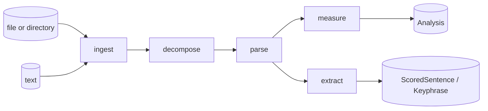

# vaani — Architecture

NLP library. Text in, structured analysis out. A pure, performant, ACE-aligned NLP library in Rust with Python bindings via PyO3.

## Read in this order

1. **[architecture.md](architecture.md)** — the big picture: single-crate shape, hex layout, composition root, boundary rules, cross-language story.
2. **[domain-model.md](domain-model.md)** — the data shapes everything else depends on. Read this if you are touching any type.
3. **[ports.md](ports.md)** — the three boundary traits: `Source`, `Decomposer`, `NlpProvider`. Read this if you are adding a new format, NLP backend, or input shape.
4. **[adapters.md](adapters.md)** — concrete implementations of the ports.
5. **[evolution.md](evolution.md)** — what's locked, what's allowed to change, what's deferred.
6. **[rust-mastery-audit.md](rust-mastery-audit.md)** — gap analysis against the rust-mastery corpus at `~/radix-workspaces/rust-mastery/`.

## Pipeline at a glance

Five verbs. Four sequential, one peer.

- `ingest` reads bytes and produces a `RawDocument`.
- `decompose` breaks a document into structural units (sections, paragraphs).
- `parse` annotates text with linguistic structure (tokens, dep tree).
- `measure` produces scalars (readability, lexical density, compression ratio, TTR, nominalization, passive ratio).
- `extract` produces selections (top sentences via TF-IDF / TextRank, key phrases via RAKE / YAKE).

`measure` and `extract` are peers, not nested. They both consume parsed sentences and produce different kinds of artifact: aggregations vs selections.

## Invariants that hold today

These are enforced by the code (and the boundary check script for the structural rules):

1. `domain.rs` has zero internal dependencies beyond `serde`, `thiserror`, and `std`.
2. Port modules (`source/mod.rs`, `decompose/mod.rs`, `nlp/mod.rs`) import only from `domain`. They do not import each other.
3. Each adapter implements one port. Adapters do not import each other.
4. `nlp/udpipe.rs` is the only file allowed to import `udpipe_rs`.
5. `metrics/` and `extraction/` import only from `domain` and `stopwords`.
6. `cargo check --no-default-features` must compile.
7. The composition root (`lib.rs`) is the only place that knows all adapters and all ports.

Rules 3, 4, and 2 (port isolation) are checked by `scripts/check-boundaries.sh` and run in CI.

## ACE: the design discipline

vaani is built around three forces, each countering a known decay mode in long-lived libraries.

- **Adaptable** — design for change. `#[non_exhaustive]` on every public type. Configuration over hardcoding. Feature flags are additive and orthogonal.
- **Composable** — discrete components, clear boundaries, swappable parts. Three ports, multiple adapters per port, one composition root.
- **Extensible** — clear interfaces that invite contribution without requiring full comprehension. Add a new `Source`, `Decomposer`, or `NlpProvider` adapter without reading the rest of the codebase.

vaani is **pure**: it does not opine on what good prose looks like. It produces the trees, scalars, and selections; consumer code opines.

vaani is **performant**: bounded memory, O(n) algorithms where possible, capped where not. No silent quadratic surprises.

vaani is **enabling**: a substrate. Designed so other libraries do meaningful work on top without forking the core.

Names appear in three languages (Rust, Python, TypeScript via WASM when that crust lands) and become public field paths. They are contracts.
