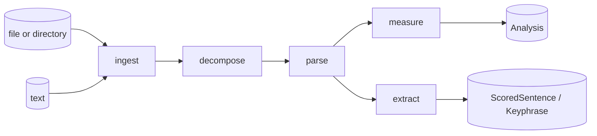

# vaani — Architecture

Prose metrics engine. Text in, structured analysis out. A pure, performant, ACE-aligned NLP library in Rust.

## Read in this order

1. **[architecture.md](architecture.md)** — the big picture: workspace shape (`vaani-core` + `rumi-nlp`), hex layout inside `vaani-core`, composition root, boundary rules, cross-language story, the deferred-reactor decision.
2. **[domain-model.md](domain-model.md)** — the data shapes everything else depends on. Read this if you are touching any type.
3. **[ports.md](ports.md)** — the three boundary traits: `Source`, `Decomposer`, `NlpProvider`. Read this if you are adding a new format, NLP backend, or input shape.
4. **[adapters.md](adapters.md)** — concrete implementations of the ports. Plus a note on why `rumi-nlp` is a peer crate, not an adapter.
5. **[evolution.md](evolution.md)** — how the architecture changes across iterations. Read this if you are planning the next iteration or want to know why something is the way it is.

## Pipeline at a glance

Five verbs. Four sequential, one peer.

- `ingest` reads bytes and produces a `RawDocument`.
- `decompose` breaks a document into structural units (sections, paragraphs).
- `parse` annotates text with linguistic structure (tokens, dep tree).
- `measure` produces scalars (readability, lexical density, compression ratio, TTR, nominalization, passive ratio).
- `extract` produces selections (top sentences via TF-IDF / TextRank, key phrases via RAKE / YAKE).

`measure` and `extract` are peers, not nested. They both consume parsed sentences and produce different kinds of artifact: aggregations vs selections.

## Invariants you cannot break

These are non-negotiable. Every change is checked against them.

1. `domain.rs` has zero internal dependencies. Only `serde` and `std`. Not `tracing`. Not anything else.
2. Port modules (`source/mod.rs`, `decompose/mod.rs`, `nlp/mod.rs`) import only from `domain`. They do not import each other.
3. Each adapter implements one port. Adapters do not import each other.
4. `nlp/udpipe.rs` is the only file allowed to import `udpipe_rs`.
5. `metrics/` and `extraction/` import only from `domain` and `stopwords`.
6. `cargo check --no-default-features` must compile.
7. The composition root (`lib.rs`) is the only place that knows all adapters and all ports.
8. **`tracing` lives only in adapters and `lib.rs`.** Never in `domain.rs` and never in port modules.

Rules 1 through 7 come from the original v2 plan and are encoded in the project `CLAUDE.md`. Rule 8 is the Burner amendment from the 2026-04-28 guild review and is the precondition for adding observability without violating rule 1.

## ACE: the design discipline

vaani is built around three forces, each countering a known decay mode in long-lived libraries.

- **Adaptable** — design for change. `#[non_exhaustive]` on every public type. Configuration over hardcoding. Feature flags are additive and orthogonal.
- **Composable** — discrete components, clear boundaries, swappable parts. Three ports, multiple adapters per port, one composition root.
- **Extensible** — clear interfaces that invite contribution without requiring full comprehension. Add a new `Source`, `Decomposer`, or `NlpProvider` adapter without reading the rest of the codebase.

vaani is **pure**: it does not opine on what good prose looks like. It produces the trees, scalars, and selections; consumer code opines.

vaani is **performant**: bounded memory, O(n) algorithms where possible, capped where not. No silent quadratic surprises.

vaani is **enabling**: a substrate. Designed so other libraries do meaningful work on top without forking the core.

Names appear in three languages (Rust, Python, TypeScript via WASM) and become public field paths. They are contracts.
