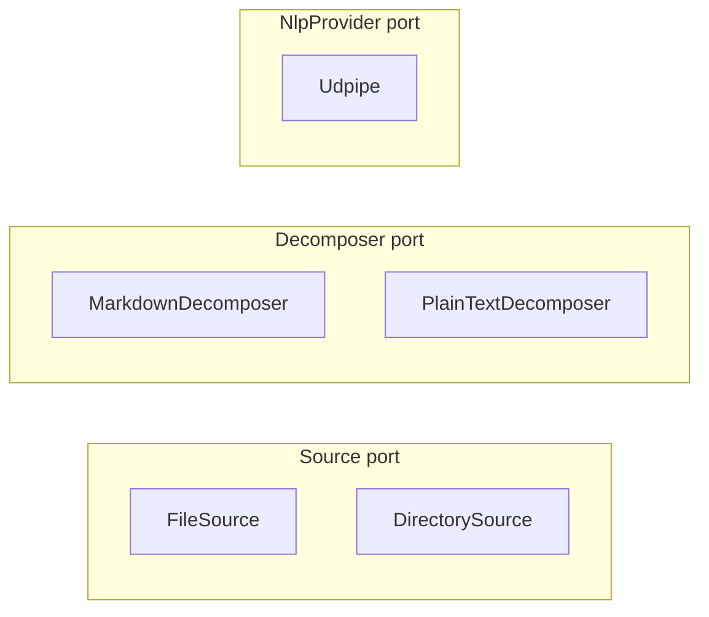

# Adapters

Adapters are the concrete implementations of ports. One adapter per port responsibility, sometimes more (e.g., `FileSource` and `DirectorySource` both implement `Source` for different shapes of path).

## `FileSource` — `src/source/file.rs`

Reads one file from disk. Detects format from extension (`.md` → Markdown, `.txt` → PlainText, `.pdf` → Pdf reserved, `.docx` → Docx reserved, anything else → PlainText).

### Constraints (post-PR2)

- Refuses symlinks (rule of consistency with `DirectorySource`; pre-PR2 was a Vector HIGH finding).
- Enforces a per-file size cap before reading; oversize files return `Error::InputTooLarge { what: "file_source", .. }` rather than OOM.
- No path canonicalization. The library does not sandbox paths. A consumer that takes user-supplied paths must validate them before calling.

### What it is not

- Not async. `std::fs::read_to_string` after the size precheck.
- Not a streaming reader. Files are loaded fully into memory; the size cap is the bound.

## `DirectorySource` — `src/source/directory.rs`

Walks a directory, returns one `RawDocument` per readable file.

### Constraints

- Skips symlinks (existing behavior, verified by test `skips_symlinks`).
- Sorts paths lexicographically before yielding (existing behavior at `directory.rs:35`; promoted from implementation detail to documented contract by Lamport).
- (Post-PR2) Per-file I/O tolerance. One unreadable file no longer aborts the batch; the error is collected and the iteration continues.
- (Post-PR4) `read_iter` inherent method yields lazily, so peak memory stays at one document.

### What it is not

- Not recursive into subdirectories beyond depth 1. (Tracked for 0.2 if consumers ask.)
- Not glob-aware. `*.md` filtering is the consumer's job.

## `MarkdownDecomposer` — `src/decompose/markdown.rs`

Parses markdown into sections. Honors heading levels, tracks blockquote membership.

### Constraints

- The function is named `decompose` (not `parse`). The pre-PR1 name was `parse`, which collided with NLP `parse` semantically (Ace verdict). The rename frees `parse` for the linguistic verb.
- Treats malformed markdown as plain text. No errors propagate.

### What it is not

- Not a full CommonMark parser. The decomposer cares about sections, paragraphs, and blockquote flags. Code blocks, tables, and emphasis are passed through as paragraph text.

## `PlainTextDecomposer` — `src/decompose/plain.rs`

Splits text on blank lines, produces one `Section` with no heading containing all paragraphs.

### Constraints

- Always produces exactly one `Section`.
- Every paragraph has `in_blockquote = false`.

## `Udpipe` — `src/nlp/udpipe.rs`

The default `NlpProvider` adapter, gated behind the `udpipe` feature flag (default-on). The only file in the codebase allowed to import `udpipe_rs` (rule 4).

### Constructors

- `Udpipe::from_path(model_path)` — load a UDPipe model from a local file.
- `Udpipe::english(model_dir)` — download the English model if absent (verified against `ENGLISH_MODEL_SHA256`), then load.

### Constraints (post-PR2)

- **Panic boundary.** `Model::parse` is wrapped in `std::panic::catch_unwind`. A C-level panic in `udpipe-rs` becomes `Err(ParseFailed { kind: ProviderInternal, .. })`, never a process abort. This is the Taleb #1 fix.
- **Atomic download.** Concurrent processes calling `english(same_dir)` no longer race on `path.exists()` and corrupt each other's downloads (Lamport BLOCK fix). The download writes to `<path>.tmp.<pid>`, then atomically `rename`s after verify.
- **No TOCTOU.** SHA-256 verify reads bytes; `Model::load` consumes the same in-memory bytes. The disk file is not re-read after verify (Vector MEDIUM fix).
- **Debug-assert on token order.** Every `parse` call asserts (in debug builds) that returned tokens are id-sorted within each sentence (Lamport).

### Threading

`Udpipe` holds a loaded `Model` that is **not** `Send` due to internal C state. The PyO3 wrapper is `#[pyclass(unsendable)]`; Python users get a runtime error if they try to share an `Engine` across threads. Multi-process Python (e.g., `ProcessPoolExecutor`) is fine; multi-thread is not.

A future `NlpProvider` adapter without C state (e.g., a pure-Rust tokenizer + tagger) could lift this restriction. The composition root takes `&dyn NlpProvider` and does not assume `Send`.

### What it is not

- Not the only possible NLP provider. The trait permits any backend.
- Not configurable for non-English languages today. Adding language slots is straightforward (`Udpipe::language(model_dir, lang)`); deferred until a consumer asks.

## Adapter constraints summary

Every adapter must:

1. Implement exactly one port. (Or one inherent helper method like `DirectorySource::read_iter` that the composition root re-exposes.)
2. Import only from `domain` and the port module it implements. Never from another adapter.
3. Live in the module that owns its port (`source/`, `decompose/`, `nlp/`).
4. Emit `tracing` spans/events for I/O and external calls. Never silently swallow errors.
5. Translate external errors into `domain::Error` variants. Never propagate `udpipe_rs` errors directly.
6. Document its contract overrides (e.g., DirectorySource sort order, Udpipe panic boundary) inline at the impl site.

## Adapters that don't exist yet

These are deliberate gaps, not oversights.

- **`PdfDecomposer`** — `Format::Pdf` returns `Error::UnsupportedFormat`. Half-shipping a PDF adapter would lock a bad shape into the public surface (PDF is a format family, not a format). Tracked for 0.2 under a feature flag.
- **`DocxDecomposer`** — same logic.
- **WASM `NlpProvider`** — a pure-Rust tagger + parser for browser/Node use. Tracked for 0.3 once the PyO3 surface is stable.
- **Streaming `Source` adapter** (websocket, filesystem watch) — only if reactor triggers fire (see [evolution.md](evolution.md)).

## `rumi-nlp`: not an adapter

`rumi-nlp` (sibling crate to `vaani-core` in the workspace) is sometimes mistaken for an `NlpProvider` adapter. It is not. The relationship:

| Concept | Belongs to | Implements / Wraps |
|---|---|---|
| `NlpProvider` | port in `vaani-core` | implemented by `Udpipe` adapter (and any future NLP backend) |
| `DataInput<Sentence>` | `rumi-core` trait | implemented in `rumi-nlp` for NLP-specific data extraction (POS, lemma, dep, subtree, etc.) |

`rumi-nlp` consumes `vaani-core`'s output (`Sentence` and `Token` from `domain.rs`). It does not implement any of `vaani-core`'s ports. It is a peer in the workspace, sitting alongside `vaani-core`, depending on it for the parsed structure and on `rumi-core` for the matcher engine.

In short: an adapter is something that plugs into a vaani port. `rumi-nlp` doesn't plug into vaani — it builds on top of vaani for a different purpose (rule-based pattern matching over parsed sentences).
