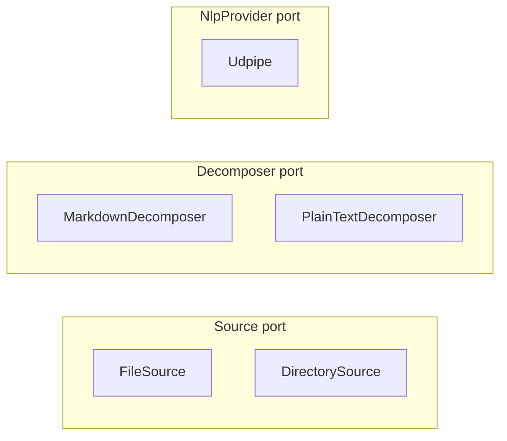

# Adapters

Adapters are the concrete implementations of ports. One adapter per port responsibility, sometimes more (e.g., `FileSource` and `DirectorySource` both implement `Source` for different shapes of path).

## `FileSource` — `src/source/file.rs`

Reads one file from disk. Detects format from extension (`.md`/`.markdown` → Markdown, `.txt` → PlainText, `.pdf` → Pdf reserved, `.docx` → Docx reserved, anything else → PlainText).

### Constraints

- **Refuses symlinks.** Uses `symlink_metadata` (non-traversing) and rejects any path whose file type is a symlink. Prevents an attacker who controls a path passed to `FileSource` from redirecting the read to an arbitrary file via a symlink.
- **Per-file size cap.** Files larger than `MAX_INPUT_BYTES` are rejected via `Error::InputTooLarge { what: "file_source", .. }` before reading into memory, so a 1 GB file does not OOM the host before the gate runs.
- **No path canonicalization.** The library does not sandbox paths. A consumer that takes user-supplied paths must validate them before calling.

### What it is not

- Not async. `std::fs::read_to_string` after the size precheck.
- Not a streaming reader. Files are loaded fully into memory; the size cap is the bound.

## `DirectorySource` — `src/source/directory.rs`

Walks a directory non-recursively, returns one `RawDocument` per readable file.

### Constraints

- **Skips symlinks** (verified by test `skips_symlinks`).
- **Lexicographic path sort** before yielding. Verified by code (`directory.rs` `candidate_paths`).
- **Per-file I/O tolerance.** One unreadable file no longer aborts the batch; `read_collecting_errors` returns successes plus per-file failures as `(Vec<RawDocument>, Vec<(PathBuf, Error)>)`. `Source::read` (the trait method) returns only the successes; callers that care about which files failed should use `read_collecting_errors` directly.

### What it is not

- Not recursive into subdirectories. Adding recursion is post-0.1; tracked if consumers ask.
- Not glob-aware. Filtering like `*.md` is the consumer's job.

## `MarkdownDecomposer` — `src/decompose/markdown.rs`

Parses markdown into sections. Honors heading levels, tracks blockquote membership.

### Constraints

- The function is named `decompose` (not `parse`). The pre-rename name was `parse`, which collided with NLP `parse` semantically. The rename freed `parse` for the linguistic verb.
- Treats malformed markdown as plain text. No errors propagate.

### What it is not

- Not a full CommonMark parser. The decomposer cares about sections, paragraphs, and blockquote flags. Code blocks, tables, and emphasis are passed through as paragraph text.

## `PlainTextDecomposer` — `src/decompose/plain.rs`

Splits text on blank lines, produces one `Section` with no heading containing all paragraphs.

### Constraints

- Always produces exactly one `Section`.
- Every paragraph has `in_blockquote = false`.

## `Udpipe` — `src/nlp/udpipe.rs`

The default `NlpProvider` adapter, gated behind the `udpipe` feature flag (default-on). The only file in the codebase allowed to import `udpipe_rs` (rule 4).

### Constructors

- `Udpipe::from_path(model_path)` — load a UDPipe model from a local file.
- `Udpipe::from_bytes(data)` — load from in-memory bytes.
- `Udpipe::english(model_dir)` — download the English model if absent (verified against `ENGLISH_MODEL_SHA256`), then load.

### Constraints

- **Panic boundary.** `Model::parse` is wrapped in `std::panic::catch_unwind`. A C-level panic in `udpipe-rs` becomes `Err(ParseFailed(_))`, never a process abort. Without this wrapper, a panic inside `Model::parse` would abort the host process (interpreter death in Python, trap in WASM).
- **Atomic download.** Concurrent processes calling `english(same_dir)` cannot corrupt each other's downloads. Each downloads to its own `.tmp.download.<pid>` subdirectory and `std::fs::rename`s the file into place. Rename is atomic on the same filesystem.
- **No TOCTOU.** `read_and_verify` returns the verified bytes; `from_bytes` consumes the same in-memory bytes. The disk file is not re-read after verify. An attacker with write access to the model directory who swaps the file between verify and a hypothetical second read cannot affect the loaded model, because no second read happens.

### Threading

`Udpipe` holds a loaded `Model` that is **not** `Send` due to internal C state. The PyO3 wrapper `Matra` is `#[pyclass(unsendable)]`; Python users get a runtime error if they try to share an instance across threads. Multi-process Python (e.g., `ProcessPoolExecutor`) is fine; multi-thread is not.

A future `NlpProvider` adapter without C state (e.g., a pure-Rust tokenizer + tagger) could lift this restriction. The composition root takes `&dyn NlpProvider` and assumes `Send` but not `Sync`.

### What it is not

- Not the only possible NLP provider. The trait permits any backend.
- Not configurable for non-English languages today. Adding language slots is straightforward (`Udpipe::language(model_dir, lang)`); deferred until a consumer asks.

## Adapter constraints summary

Every adapter must:

1. Implement exactly one port. (Or one inherent helper method like `DirectorySource::read_collecting_errors` that the composition root re-exposes.)
2. Import only from `domain` and the port module it implements. Never from another adapter.
3. Live in the module that owns its port (`source/`, `decompose/`, `nlp/`).
4. Translate external errors into `domain::Error` variants. Never propagate `udpipe_rs` errors directly.
5. Document its contract overrides (e.g., `DirectorySource` sort order, `Udpipe` panic boundary) inline at the impl site.

## Adapters that don't exist yet

These are deliberate gaps, not oversights.

- **`PdfDecomposer`** — `Format::Pdf` returns `Error::UnsupportedFormat`. Half-shipping a PDF adapter would lock a bad shape into the public surface (PDF is a format family, not a format). Tracked post-0.1 under a feature flag.
- **`DocxDecomposer`** — same logic.
- **WASM `NlpProvider`** — a pure-Rust tagger + parser for browser/Node use. Tracked once the PyO3 surface is stable and a TypeScript consumer commits.
- **Streaming `Source` adapter** (websocket, filesystem watch) — only if a consumer needs push semantics. See [evolution.md](evolution.md) for the trigger conditions.
