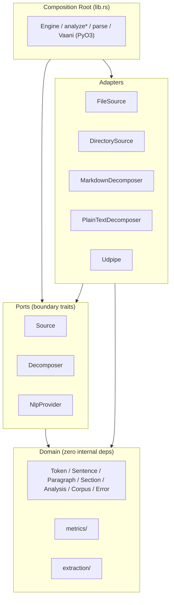
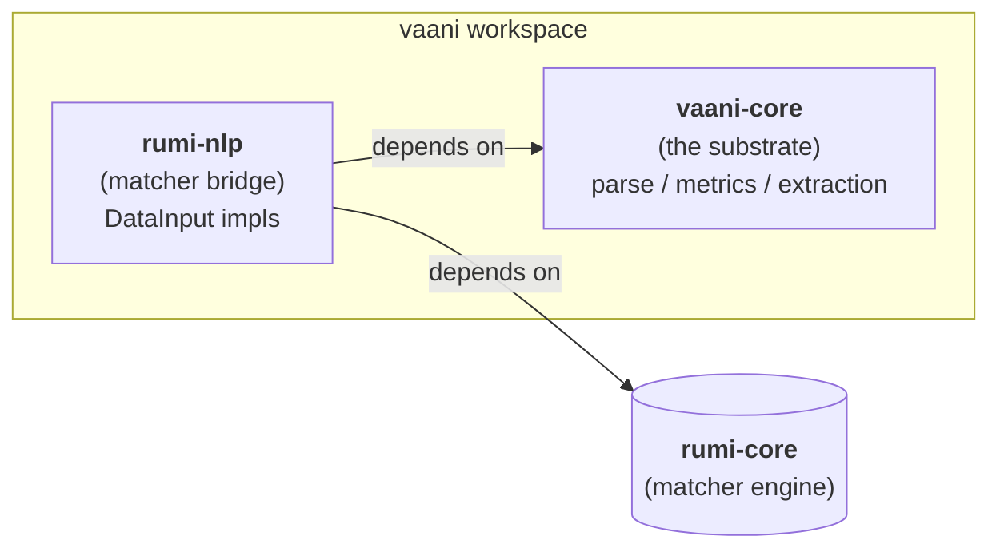
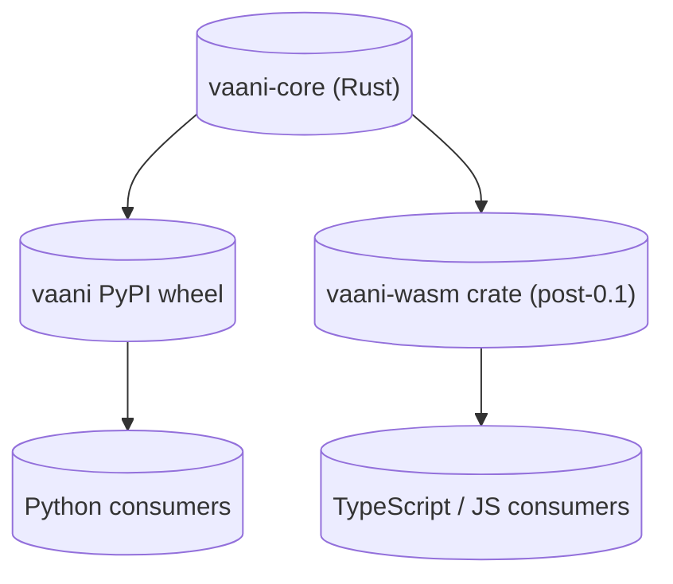

# Architecture

## The shape

vaani is a Cargo workspace with two crates: `vaani-core` (the substrate) and `rumi-nlp` (the matcher bridge). `vaani-core` is a hexagonal architecture: a pure domain core surrounded by ports (boundary traits), implemented by adapters (concrete I/O and infrastructure), wired together by a composition root (`lib.rs`). `rumi-nlp` is a peer crate that depends on `vaani-core` for the domain types and on `rumi-core` for the matcher engine.



Read it as: dependencies point inward. Nothing in `domain` knows that adapters exist. Adapters know about `domain` and the port they implement; they do not know about each other or about the composition root. The composition root is the only thing that knows everything.

## The workspace



`vaani-core` has zero dependency on `rumi-nlp` or `rumi-core`. A consumer who wants only parsing, metrics, and extraction adds `vaani` and pays for nothing else. A consumer who wants matcher-driven rule evaluation over parsed sentences adds `vaani` plus `rumi-nlp`.

**Why this shape.** Domain knowledge belongs colocated with the substrate that produces it. The matcher-engine bridge that exposes `Sentence` as a context for `DataInput`s is part of vaani's deliverable, not a separate downstream concern. Other matcher-engine extensions (`rumi-http`, `rumi-claude`) live with their respective domain owners; NLP is vaani's domain, so `rumi-nlp` lives with vaani.

**What ships in `rumi-nlp` at 0.1.0.** A skeleton: the crate exists, the dependency wiring is verified, one trivial `DataInput<Sentence>` (e.g., `PosInput`) lands as a smoke test. Domain-specific patterns (SVO, copular, prepositional, passive, nominal modifier extraction; stance classification) are deferred to post-publish iterations driven by real consumer needs. The structure locks; the content fills.

The rest of this document focuses on `vaani-core`'s internal architecture (the hex). The matcher-bridge pattern is documented in [evolution.md](evolution.md) and the I4 implan.

## Why hex for a substrate library

Three forces pushed this shape.

**Variable I/O needs.** A library wired into a CLI batch tool needs different ingestion than one embedded in an editor that streams documents as a user types, or one running headless against in-memory text. A hard-coded pipeline serves at most one of these. Ports let each consumer wire what they need.

**Cross-language reach.** Rust core + Python crust + WASM crust. The domain types travel across FFI; the adapters do not. Keeping the boundary explicit means the FFI surface is exactly the domain types and a thin wrapper, not the whole library.

**Pre-publish economics.** Once 0.1.0 ships, the public surface is locked. Hex puts the surface where the contracts are (port traits + domain types) and keeps everything else replaceable.

## The composition root

`crates/vaani-core/src/lib.rs` is the only file that:
- Imports adapters and ports together.
- Wires the pipeline (`analyze`, `analyze_markdown`, `analyze_file`, `analyze_directory`, `analyze_directory_iter`, `parse`, `analyze_from`).
- Exposes the PyO3 `Vaani` class.
- Enforces `MAX_INPUT_BYTES` at every public entry point.
- Owns the `Engine` struct (Rust DX parity with the Python `Vaani`).

Everything else is replaceable. The composition root is not.

## The pipeline through-line

```
ingest → decompose → parse → measure
                     parse → extract
```

Four sequential stages plus one peer. Each stage has a precondition and a postcondition the next stage relies on.

| Stage | Input | Output | Postcondition |
|---|---|---|---|
| ingest | path or text | `RawDocument` | format detected; bytes resident; size `≤ MAX_INPUT_BYTES` |
| decompose | `RawDocument` | `Vec<Section>` | paragraphs in document order; `in_blockquote` set |
| parse | `&str` (per paragraph) | `Vec<Sentence>` | sentences in document order; tokens id-sorted; valid `head` references |
| measure | `&mut Analysis, &[Sentence]` | enriched `Analysis` | every paragraph has `Some(metric)` if its sentences were assigned, `None` if not applicable |
| extract | `&[Sentence]` | `Vec<ScoredSentence>` or `Vec<Keyphrase>` | descending score; cap-bounded |

The `parse` stage runs **per paragraph**, not per document. This is the Knuth-correctness fix that resolves the `attach_sentences` prefix-match defect: parsing per paragraph removes the need to wire sentences back to paragraphs by string match. The mapping is implicit in iteration order.

## Boundary rules in force

These come from the project `CLAUDE.md` (rules 1 through 7) plus one amendment.

1. `domain.rs` has zero internal dependencies. Only `serde` and `std`.
2. Port modules import only from `domain`.
3. No port module imports another port module.
4. `nlp/udpipe.rs` is the only file that imports `udpipe_rs`.
5. `metrics/` and `extraction/` import only from `domain` and `stopwords`.
6. `cargo check --no-default-features` must compile.
7. The composition root is the only place that knows all adapters and ports.
8. (Burner amendment, 2026-04-28) `tracing` is in adapters and `lib.rs` only. Never in `domain.rs` or port modules.

Rule 8 is the precondition for the observability story. Without it, adding `tracing` violates rule 1. With it, observability is additive and reversible.

A boundary check script (`scripts/check-boundaries.sh`) verifies these in CI:

```sh
# Rule 4 (post-I4 paths; pre-I4 paths drop the crates/vaani-core/ prefix)
rg 'use udpipe_rs' crates/vaani-core/src/ | grep -v '^crates/vaani-core/src/nlp/udpipe.rs'

# Rule 8
rg '^use tracing|tracing::' crates/vaani-core/src/domain.rs crates/vaani-core/src/source/mod.rs crates/vaani-core/src/decompose/mod.rs crates/vaani-core/src/nlp/mod.rs

# Rule 3
rg 'use crate::source|use crate::decompose|use crate::nlp' crates/vaani-core/src/source/mod.rs crates/vaani-core/src/decompose/mod.rs crates/vaani-core/src/nlp/mod.rs
```

Each command must return empty.

## Feature flags

Three features. Each is additive. Each is independent.

| Feature | What it enables | Default? |
|---|---|---|
| `udpipe` | UDPipe NLP adapter and the `Udpipe` struct | yes |
| `python` | PyO3 bindings, the `Vaani` class, `_core` module | no |
| `otel` | `tracing-opentelemetry` exporter (post-0.1.0) | no |

`tracing` itself is **always on**. It is a hard dependency. With no subscriber installed, the macros compile to near-nothing.

Without `udpipe`: vaani still has the domain types, the metrics, the extraction algorithms, and the PyO3 surface (which gates UDPipe-specific methods with `#[cfg(feature = "udpipe")]`). Anyone can plug in a different `NlpProvider`.

Without `python`: vaani is a pure Rust library.

## Cross-language story

The Rust workspace is the reference. Two crusts wrap `vaani-core`.



`rumi-nlp` is Rust-only at 0.1.0. Adding Python or WASM crusts for the matcher bridge happens post-publish and only when a consumer commits to needing it.

Names cross all three. Every public field, type, error variant, and method becomes:

- A Rust struct/enum.
- A Python class/dict key (via `pythonize` and a `VaaniError` exception class with `kind`/`is_fatal`/`is_skip_doc` attributes).
- A TypeScript interface (post-0.1, via `wasm-bindgen` + `serde-wasm-bindgen`).

Methods do not cross. Only fields do. This is why `Analysis::passive_ratio()` should ultimately be cached in a `ProseSummary` field rather than left as a method (tracked for 0.2). For 0.1.0 the methods stay; the contract is documented as "Python and WASM consumers must recompute aggregates."

## The reactor decision

Erlang and K both said defer. The original user request was to leverage the reactor pattern. The convergence: ship the **streaming iterator** (`analyze_directory_iter`) as the drainage primitive, defer the reactor.

The reactor comes back when **any one** of:

1. A consumer needs incremental re-analysis on file change (push semantics).
2. A corpus consumer reports more than 100k documents in regular use.
3. A second `Source` arrives that is inherently push (websocket, filesystem watch, message queue).

Until one of those triggers, the streaming iterator is sufficient. The iterator boundary is exactly where a channel slots in if the reactor ever lands. Earliest realistic version: 0.3.

The triggers are listed here so we know when to revisit. If none of them fire, the reactor never ships and that is the correct answer.

## Composition: how a request flows

A consumer calls `engine.analyze("some text")`. What happens:

1. **Composition root** (`lib.rs::analyze`): checks input size against `MAX_INPUT_BYTES`. Opens an `INFO` span `vaani.analyze`.
2. **decompose** (`PlainTextDecomposer::decompose`): produces `Vec<Section>` with one section, paragraphs split on blank lines.
3. **parse** (per-paragraph loop): each paragraph's text passed to `NlpProvider::parse`, returning `Vec<Sentence>`. Wrapped in `vaani.nlp.parse` `INFO` span. UDPipe-specific panic boundary lives inside `Udpipe::parse`.
4. **measure** (`metrics::run_suite`): runs the default metric suite over the sentences. Per-metric `DEBUG` spans.
5. **return**: `Analysis` populated, span closes with summary fields (`paragraph_count`, `sentence_count`, `total_words`).

Errors at any step are emitted as structured `tracing::error!` events **before** propagation, never after. The `Error` variant carries the recovery contract (`is_skip_doc`, `is_fatal`); the tracing event carries the diagnosis (path, kind, span context). Don't conflate them.

## What this architecture is not

- **Not a framework.** Consumers compose ports themselves if they need to. The composition root is one example, not the only path.
- **Not async.** The pipeline is synchronous through the streaming iterator. Async arrives only if the reactor triggers fire.
- **Not opinionated about prose quality.** vaani measures; consumer code judges.
- **Not a complete pipeline.** PDF and DOCX adapters do not exist. `Format::Pdf` and `Format::Docx` return `Error::UnsupportedFormat`. This is deliberate; half-shipping a PDF adapter would lock a bad shape into the public surface.
