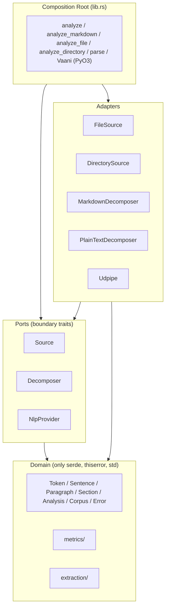
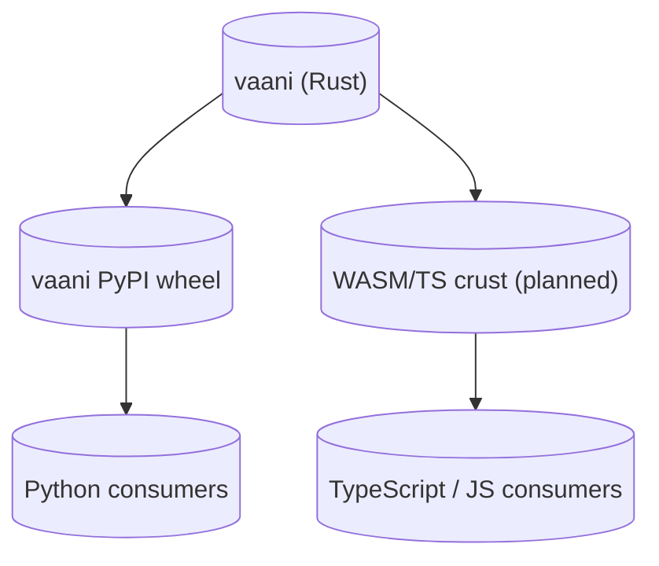

# Architecture

## The shape

vaani is a single Cargo crate organized as a hexagonal architecture: a pure domain core surrounded by ports (boundary traits), implemented by adapters (concrete I/O and infrastructure), wired together by a composition root (`lib.rs`).



Read it as: dependencies point inward. Nothing in `domain` knows that adapters exist. Adapters know about `domain` and the port they implement; they do not know about each other or about the composition root. The composition root is the only thing that knows everything.

## Single-crate today

vaani is a single Cargo crate. An earlier ADR (`docs/decisions/0003-workspace-with-rumi-nlp.md`) proposed splitting into `vaani-core` + a sibling crate; that proposal is now superseded by `docs/decisions/0004-stay-single-crate.md`. The split criterion (Pattern 6 from the rust-mastery corpus: separately publish a minimal port crate when an external implementor ecosystem exists) has not fired yet — vaani has no third-party `NlpProvider` implementors. Until it does, the single-crate shape is correct.

If and when external NLP backends emerge (`vaani-stanza`, `vaani-spacy`, etc. shipped by third parties), extract `vaani-nlp-api` and keep `vaani` as the consumer-facing crate.

## Why hex for a substrate library

Three forces pushed this shape.

**Variable I/O needs.** A library wired into a CLI batch tool needs different ingestion than one embedded in an editor that streams documents as a user types, or one running headless against in-memory text. A hard-coded pipeline serves at most one of these. Ports let each consumer wire what they need.

**Cross-language reach.** Rust core + Python crust + future WASM crust. The domain types travel across FFI; the adapters do not. Keeping the boundary explicit means the FFI surface is exactly the domain types and a thin wrapper, not the whole library.

**Pre-publish economics.** Once 0.1.0 ships, the public surface is locked. Hex puts the surface where the contracts are (port traits + domain types) and keeps everything else replaceable.

## The composition root

`src/lib.rs` is the only file that:
- Imports adapters and ports together.
- Wires the pipeline (`analyze`, `analyze_markdown`, `analyze_file`, `analyze_directory`, `parse`, `analyze_from`).
- Exposes the PyO3 `Vaani` class behind the `python` feature.
- Enforces `MAX_INPUT_BYTES` at every public entry point.

Everything else is replaceable. The composition root is not.

## The pipeline through-line

```
ingest → decompose → parse → measure
                     parse → extract
```

Four sequential stages plus one peer. Each stage has a precondition and a postcondition the next stage relies on.

| Stage | Input | Output | Postcondition |
|---|---|---|---|
| ingest | path or text | `RawDocument` | format detected; bytes resident; size `≤ MAX_INPUT_BYTES` |
| decompose | `RawDocument` | `Vec<Section>` | paragraphs in document order; `in_blockquote` set |
| parse | `&str` (per paragraph) | `Vec<Sentence>` | sentences in document order; tokens id-sorted; valid `head` references |
| measure | `&mut Analysis, &[Sentence]` | enriched `Analysis` | every paragraph has `Some(metric)` if its sentences were assigned, `None` if not applicable |
| extract | `&[Sentence]` | `Vec<ScoredSentence>` or `Vec<Keyphrase>` | descending score; cap-bounded |

The `parse` stage runs **per paragraph**, not per document. This is the correctness fix that resolves an earlier `attach_sentences` prefix-match defect: parsing per paragraph removes the need to wire sentences back to paragraphs by string match. The mapping is implicit in iteration order.

## Boundary rules in force

These are stated in `CLAUDE.md` and the project root `arch/README.md`; this section restates them so the architecture document is self-contained:

1. `domain.rs` has zero internal dependencies beyond `serde`, `thiserror`, and `std`.
2. Port modules import only from `domain`.
3. No port module imports another port module.
4. `nlp/udpipe.rs` is the only file that imports `udpipe_rs`.
5. `metrics/` and `extraction/` import only from `domain` and `stopwords`.
6. `cargo check --no-default-features` must compile.
7. The composition root is the only place that knows all adapters and ports.

A boundary check script (`scripts/check-boundaries.sh`) verifies rules 2, 3, and 4 in CI:

```sh
# Rule 4: only nlp/udpipe.rs imports udpipe_rs
rg -l 'use udpipe_rs|udpipe_rs::' src/ --glob '!src/nlp/udpipe.rs'

# Rule 3: port modules do not import each other
rg -l 'use crate::source|use crate::decompose|use crate::nlp' \
    src/source/mod.rs src/decompose/mod.rs src/nlp/mod.rs
```

Each command must return empty.

Rules 1, 5, 6, and 7 are enforced by the type system + `cargo check` and do not need a script.

## Feature flags

Two features today. Each is additive. Each is independent.

| Feature | What it enables | Default? |
|---|---|---|
| `udpipe` | UDPipe NLP adapter and the `Udpipe` struct | yes |
| `python` | PyO3 bindings, the `Vaani` class, `_core` module | no |

`maturin develop` and `maturin build` activate the `python` feature via `[tool.maturin].features` in `pyproject.toml`.

Without `udpipe`: vaani still has the domain types, the metrics, the extraction algorithms, and the boundary traits. Any caller can plug in a different `NlpProvider`.

Without `python`: vaani is a pure Rust library. `cargo check --no-default-features` is the contract that this stays true.

## Cross-language story

The Rust crate is the reference. One crust ships today; one is planned.



Names cross all crusts. Every public field, type, error variant, and method becomes:

- A Rust struct/enum.
- A Python class/dict key (via `pythonize`).
- A TypeScript interface (planned, via `wasm-bindgen` + `serde-wasm-bindgen`).

**Methods do not cross FFI. Only fields do.** This is why aggregate methods (e.g., `Analysis::passive_ratio()`) need to be materialized as fields if Python or WASM consumers must see them in serialized output. For 0.1.0 the methods stay; consumers across FFI either recompute or read the section tree directly.

## Composition: how a request flows

A consumer calls `vaani::analyze(text, &nlp)`. What happens:

1. **Composition root** (`lib.rs::analyze`): checks input size against `MAX_INPUT_BYTES`.
2. **decompose** (`PlainTextDecomposer::decompose`): produces `Vec<Section>` with one section, paragraphs split on blank lines.
3. **parse** (per-paragraph loop): each non-blockquote paragraph's text passed to `NlpProvider::parse`, returning `Vec<Sentence>`. UDPipe-specific panic boundary lives inside `Udpipe::parse` (via `catch_unwind`).
4. **measure** (`metrics::run_suite`): runs the default metric suite over the sentences.
5. **return**: `Analysis` populated.

Errors at any step propagate as `domain::Result<T>`. The `Error` enum's concrete variants survive the boundary so callers can match on them.

## What this architecture is not

- **Not a framework.** Consumers compose ports themselves if they need to. The composition root is one example, not the only path.
- **Not async.** The pipeline is synchronous.
- **Not opinionated about prose quality.** vaani measures; consumer code judges.
- **Not a complete pipeline.** PDF and DOCX adapters do not exist. `Format::Pdf` and `Format::Docx` return `Error::UnsupportedFormat`. This is deliberate; half-shipping a PDF adapter would lock a bad shape into the public surface.

## Future direction

These are intended capabilities, not present ones:

- **Rule evaluation over parsed text structure.** Querying parse trees with rule-like predicates (matchers over POS sequences, dep relations, lemma sets, subtrees). Lands as a sub-module inside vaani; no new crate. See [evolution.md](evolution.md) for the trigger conditions.
- **WASM/TS crust.** Same Rust core, second crust via `wasm-bindgen`. Triggers when a TypeScript consumer commits.
- **Pdf/Docx adapters.** Behind a feature flag, when a consumer needs them.
