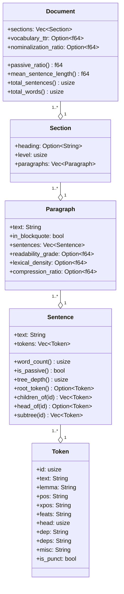

# Domain Model

Domain types are the substrate. Every other module depends on them; they depend on nothing internal beyond `serde`, `thiserror`, and `std`.

## The hierarchy



Read it as containment: a `Token` lives inside a `Sentence`, a `Sentence` inside a `Paragraph`, a `Paragraph` inside a `Section`, a `Section` inside an `Document`. Each level has its own metrics surface.

## Type catalog

### Linguistic types

**`Token`** carries the full ten-column CoNLL-U annotation (id, text, lemma, pos, xpos, feats, head, dep, deps, misc) plus one derived field (`is_punct`). Constructed via `Token::builder` to keep the struct `#[non_exhaustive]` while still allowing external crates to build instances.

**`Sentence`** is `text` plus `tokens` plus a set of infallible tree-walk methods. The methods compute on demand. None of them allocate persistent state on the sentence itself; if a downstream consumer needs amortized tree access, it builds a derived index cache outside the wire type. Keep `Sentence` clean for serde.

Invariants on `Sentence`:
- `tokens` are id-sorted ascending. UDPipe enforces this by spec; future adapters must too.
- `head = 0` means root. There should be exactly one root per sentence. The library does not assert this today; a malformed parse with two roots silently picks the first via `root_token()`. Tracked for hardening post-0.1.
- Tree walks are cycle-safe. `subtree` uses a HashSet visited set. `tree_depth` uses a HashMap-indexed bottom-up walk with memoization. The previous magic `< 20` ceiling is gone; cycles surface as `usize::MAX` for tokens transitively in the cycle, making the malformed parse loud rather than silently truncated.

### Structural types

**`Paragraph`** is a paragraph of prose with metric slots that fill in during `measure`. `in_blockquote = true` paragraphs are skipped for metric computation; their `Option<f64>` slots stay `None`.

**`Section`** is a heading plus a vector of paragraphs. `level` is the heading depth (0 for plain text, 1+ for markdown).

### Output types

**`Document`** is the final shape returned by `analyze*`. It contains the section tree (single source of truth for paragraph ownership) plus document-level metric slots (`vocabulary_ttr`, `nominalization_ratio`).

Aggregates (`total_sentences`, `total_words`, `passive_ratio`, `mean_sentence_length`, `sentence_length_std`) are methods today. Cross-FFI consumers (Python via `pythonize`, WASM via `serde-wasm-bindgen` when that crust lands) see fields, not methods. If/when these aggregates need to be available cross-FFI, materialize them as fields on a new sealed summary type; do not expose methods through the FFI boundary.

**`Corpus`** is a vector of `CorpusEntry` (path + analysis). Has `total_words`, `passive_ratio`, `mean_readability` methods.

**`ScoredSentence`** is `{ text, score, position }`. Output of TF-IDF and TextRank.

**`Keyphrase`** is `{ phrase, score }`. Output of RAKE and YAKE.

### Source / corpus types

**`RawDocument`** is `{ text, path, format }`. Output of `Source`, input to `Decomposer`.

**`Format`** is an enum: `Markdown`, `PlainText`, `Pdf`, `Docx`. The last two are reserved; today they return `Error::UnsupportedFormat`.

### Errors

The error type is matchable, not opaque. Derive-based via `thiserror`:

```rust
#[derive(thiserror::Error, Debug)]
#[non_exhaustive]
pub enum Error {
    #[error("model not found: {0}")]
    ModelNotFound(PathBuf),

    #[error("invalid model: {0}")]
    ModelInvalid(String),

    #[error("parse failed: {0}")]
    ParseFailed(String),

    #[error("{what} input too large: {actual} > limit {limit}")]
    InputTooLarge { limit: usize, actual: usize, what: &'static str },

    #[error("unsupported format: {0:?}")]
    UnsupportedFormat(Format),

    #[error("io error: {0}")]
    Io(#[from] std::io::Error),
}
```

`#[non_exhaustive]` is in force on the enum — variant additions are backward-compatible. `#[from] std::io::Error` makes the `?` operator convert at the boundary.

The PyO3 layer wraps `domain::Error` in a private `MatraError` newtype (`src/lib.rs`) whose `From<..> for PyErr` impl maps each variant to a specific Python exception class (`PyFileNotFoundError` for `ModelNotFound`, `PyValueError` for `InputTooLarge` / `UnsupportedFormat`, `PyRuntimeError` for `ParseFailed` / `ModelInvalid`, `PyOSError` for `Io`). See `src/lib.rs` `From<domain::Error> for PyErr`.

## What stays out of `domain.rs`

These are commonly-tempting violations of the domain-purity rule. They do not belong in `domain.rs`:

- `udpipe_rs` types. Provider-specific. Lives only in `nlp/udpipe.rs`.
- `pyo3` types. FFI concern. Lives only in `lib.rs::python`.
- I/O. `std::fs::read_to_string` is in adapters, not domain.
- Network. The model download path is in `nlp/udpipe.rs`.

When in doubt: if the type would change shape because of an external service or adapter, it does not belong in `domain.rs`.

## Cross-language considerations

Every type in this file appears in at least two languages today, three when the WASM crust lands:

- **Rust struct/enum** with `#[derive(Serialize, Deserialize)]` for serde and `#[non_exhaustive]` for forward compatibility.
- **Python dict** via `pythonize`. Field names become string keys. Methods do not appear.
- **TypeScript interface** (planned, via `serde-wasm-bindgen`). Same field names. Same methods-do-not-appear rule.

When considering a rename or new type, ask: does this name read clearly in three languages? `score` and `position` are fine. `kind` alone in a Python dict next to `message` is fine. Nesting `{ data: { kind } }` is not, because Python consumers will write `result["data"]["kind"]` and forget which level they're at.
