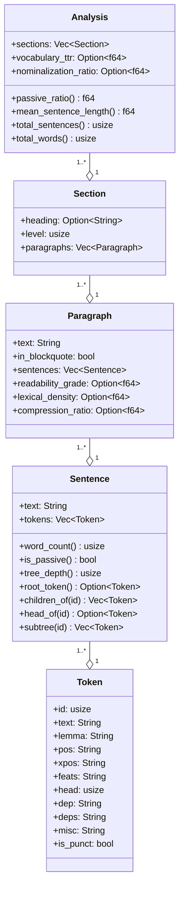

# Domain Model

Domain types are the substrate. Every other module depends on them; they depend on nothing internal.

## The hierarchy



Read it as containment: a `Token` lives inside a `Sentence`, a `Sentence` inside a `Paragraph`, a `Paragraph` inside a `Section`, a `Section` inside an `Analysis`. Each level has its own metrics surface.

## Type catalog

### Linguistic types

**`Token`** carries the full ten-column CoNLL-U annotation (id, text, lemma, pos, xpos, feats, head, dep, deps, misc) plus one derived field (`is_punct`). Constructed via `Token::builder` to keep the struct `#[non_exhaustive]` while still allowing external crates to build instances.

**`Sentence`** is `text` plus `tokens` plus a set of infallible tree-walk methods. The methods compute on demand. None of them allocate persistent state on the sentence itself; if a downstream consumer needs amortized tree access, it builds a derived `SentenceIndex` cache outside the wire type. Keep `Sentence` clean for serde.

Invariants on `Sentence`:
- `tokens` are id-sorted ascending. UDPipe enforces this by spec; future adapters must too.
- `head = 0` means root. There should be exactly one root per sentence. The library does not assert this today; a malformed parse with two roots silently picks the first via `root_token()`. Tracked for 0.2.
- Tree walks are cycle-safe. `subtree` uses a HashSet visited set. `tree_depth` (post-PR2) uses a HashMap-indexed bottom-up DFS with memoization. The pre-PR2 magic `< 20` ceiling is gone.

### Structural types

**`Paragraph`** is a paragraph of prose with metric slots that fill in during `measure`. `in_blockquote = true` paragraphs are skipped for metric computation; their `Option<f64>` slots stay `None`.

**`Section`** is a heading plus a vector of paragraphs. `level` is the heading depth (0 for plain text, 1+ for markdown).

### Output types

**`Analysis`** is the final shape returned by `analyze*`. It contains the section tree (single source of truth for paragraph ownership) plus document-level metric slots.

Aggregates (`total_sentences`, `total_words`, `passive_ratio`, `mean_sentence_length`, `sentence_length_std`) are methods today. Post-0.1, they will be cached as fields in a `ProseSummary` sealed struct so Python and WASM consumers see them in serialized output. For 0.1.0 they stay as methods; consumers across the FFI must recompute or read the section tree directly.

**`Corpus`** is a vector of `CorpusEntry` (path + analysis). Has `total_words`, `passive_ratio`, `mean_readability` methods.

**`CorpusResult`** (added in PR4): `{ corpus: Corpus, errors: Vec<(PathBuf, Error)> }`. Replaces the awkward `(Corpus, Vec<...>)` tuple at the public API. `pythonize` over `CorpusResult` produces a clean dict; over a tuple it does not.

**`ScoredSentence`** is `{ text, score, position }`. Output of TF-IDF and TextRank.

**`Keyphrase`** is `{ phrase, score }`. Output of RAKE and YAKE.

### Source / corpus types

**`RawDocument`** is `{ text, path, format }`. Output of `Source`, input to `Decomposer`.

**`Format`** is an enum: `Markdown`, `PlainText`, `Pdf`, `Docx`. The last two are reserved; today they return `Error::UnsupportedFormat`.

### Errors

The error type carries both the diagnostic surface and the recovery contract.

```rust
#[non_exhaustive]
pub enum Error {
    ModelNotFound(PathBuf),
    ModelInvalid { message: String, recoverable: bool },
    ParseFailed { kind: ParseFailKind, message: String },
    InputTooLarge { limit: usize, actual: usize, what: &'static str },
    UnsupportedFormat(Format),
    SourceIo { path: PathBuf, kind: io::ErrorKind },
    ModelIo { path: PathBuf, kind: io::ErrorKind },
}

#[non_exhaustive]
pub enum ParseFailKind {
    Empty,
    MalformedInput,
    ProviderInternal,
    ResourceLimit,
}

impl Error {
    pub fn is_skip_doc(&self) -> bool { /* ... */ }
    pub fn is_fatal(&self) -> bool { /* ... */ }
    pub fn parse_kind(&self) -> Option<&ParseFailKind> { /* ... */ }
}
```

The split of the old `Error::Io(std::io::Error)` into `SourceIo` and `ModelIo` is Dijkstra's refinement. `ENOENT` on a corpus file is skip-doc; `EACCES` on the model file is fatal. With the split, `is_fatal()` is decidable from the variant alone.

`recoverable: bool` on `ModelInvalid` is operational, not philosophical:
- `true` = retry with redownload could succeed (truncated file, mid-download corruption).
- `false` = retry will not help (hash mismatch on fresh download, format unsupported by linked udpipe-rs version).

`tracing` does not appear in `domain.rs`. Errors carry the recovery contract; tracing events at the `Err(...)` site carry the diagnosis. The two are paired but separate.

## Truth table for recovery accessors

| Variant | `is_skip_doc` | `is_fatal` |
|---|---|---|
| `SourceIo` | true | false |
| `ModelIo` | false | true |
| `ModelNotFound` | false | true |
| `ModelInvalid { recoverable: true }` | false | false |
| `ModelInvalid { recoverable: false }` | false | true |
| `ParseFailed` | true | false |
| `InputTooLarge` | true | false |
| `UnsupportedFormat` | true | false |

A consumer running `analyze_directory_iter` skips on `is_skip_doc()`, aborts on `is_fatal()`. The middle case (`recoverable: true` and neither flag) is the retry-this-doc state.

## What stays out of `domain.rs`

These are commonly-tempting violations of rule 1. They do not belong in `domain.rs`:

- `tracing` imports or macros. Tracing is an observability concern, not a data concern. Lives in adapters and `lib.rs`.
- `udpipe_rs` types. Provider-specific. Lives only in `nlp/udpipe.rs`.
- `pyo3` types. FFI concern. Lives only in `lib.rs::python`.
- I/O. `std::fs::read_to_string` is in adapters, not domain.
- Network. The model download path is in `nlp/udpipe.rs`.

When in doubt: if the type would change shape because of an external service or adapter, it does not belong in `domain.rs`.

## Cross-language considerations

Every type in this file appears in three languages:

- **Rust struct/enum** with `#[derive(Serialize, Deserialize)]` for serde and `#[non_exhaustive]` for forward compatibility.
- **Python dict** via `pythonize`. Field names become string keys. Methods do not appear.
- **TypeScript interface** (post-0.1, via `serde-wasm-bindgen`). Same field names. Same methods-do-not-appear rule.

When considering a rename or new type, ask: does this name read clearly in three languages? `parse_kind` is fine. `extract_kind` would also be fine. `kind` alone in a Python dict next to `message` is fine. Nesting `{ data: { kind } }` is not, because Python consumers will write `result["data"]["kind"]` and forget which level they're at.
