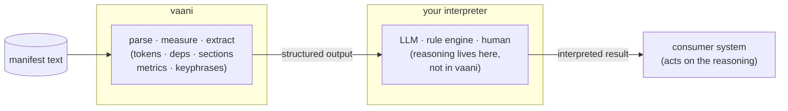
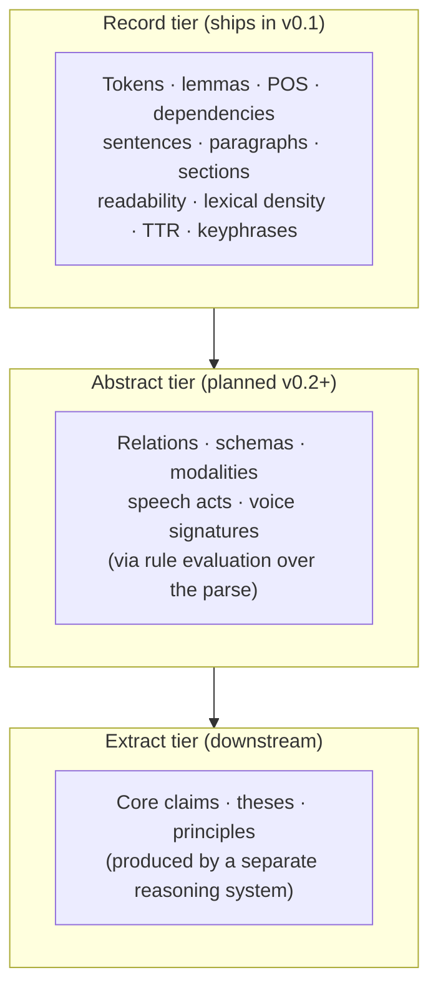

# What vaani illuminates

> **vaani illuminates the internal structural makeup of text, enabling effective higher-order reasoning on text.**

That sentence is not marketing copy. Each word earns its place. This page unpacks why.

> **Status markers used throughout this docsite:**
> - ✅ Ships in v0.1: available now
> - 🛠️ Planned v0.2+: designed but not yet shipped

---

## "Illuminates"

The verb is deliberate. Not "parses," not "measures," not "analyzes."

Parse is one operation. Illumination is the outcome: structure that was already present in the text becomes visible. A sentence like "The committee rejected the proposal without explanation" has an agent (committee), a patient (proposal), a negated purpose clause, and a passive-adjacent construction. None of that structure is explicit in the surface form. It is latent. UDPipe's dependency parse makes it explicit: the `nsubj` arc connecting "committee" to "rejected," the `obj` arc connecting "proposal" to "rejected," the `prep` arc carrying "without." The structure was there. vaani makes it accessible.

"Accessible" matters because reasoning systems (whether an LLM, a rule engine, or a human analyst) can only operate on handles. They cannot query "the agent of the main clause" from flat bytes. They can query a structured field.

That is what illumination means concretely: a transition from text-as-opaque-surface to text-as-queryable-structure.

## "Internal structural makeup"

This phrase is specific by design.

It is not "structure" in the generic sense. The phrase names vaani's particular service: the makeup of what's inside a piece of text. Tokens and their part-of-speech assignments. Lemmas. Dependency arcs that connect subject to verb to object. Sentence boundaries. Paragraph boundaries. Section hierarchy. These are not features extracted from the text. They are the structure the author used to mean what they meant. vaani reveals them; it does not add them.

It is not "metrics" either. Readability grade ✅, lexical density ✅, vocabulary type-token ratio ✅, nominalization ratio ✅, passive ratio ✅: these are measurements derived from the structural makeup. The makeup comes first; the measurements follow. A passive ratio is only meaningful because vaani first resolves which constructions are passive (via dependency labels like `aux:pass`). You cannot measure what you cannot see.

## "Enabling effective higher-order reasoning on text"

vaani does not reason. It structures. The reasoning is yours.

The architectural separation is intentional:

This is positioning, not a caveat. The interpreter slot is explicitly unbundled. An LLM that receives vaani's structured output (dependency trees, passive ratios, section boundaries, ranked keyphrases) has auditable handles to reason from. It is not pattern-matching over bytes. An application that runs rules against the parse has a deterministic substrate to write predicates against. A human analyst has a structured document to query.

"Higher-order" names the category: reasoning about what a text *does*, not just what it *says*. Who is the agent? What stance does the author take? What forms is the argument using? How distinctive is this author's lexical fingerprint? Those are higher-order questions. vaani gives the ground for answering them; it does not answer them.

---

## The three tiers

vaani's reach is tiered. Understanding which tier a capability occupies is the difference between knowing what ships today and knowing what the full conviction depends on.

**Record tier ✅** is what vaani produces today. Full CoNLL-U parse with POS tags, lemmas, and dependency trees. Sentence segmentation. Paragraph and section structure with blockquote tracking. Five base metrics (Flesch-Kincaid readability, lexical density, brotli compression ratio as redundancy proxy, vocabulary TTR, nominalization ratio) plus passive ratio. Extractive summarization via TF-IDF and TextRank. Keyphrase extraction via RAKE and YAKE.

**Abstract tier 🛠️** is what rule evaluation will deliver. Rules run predicate logic against the record-tier parse to surface relations between entities, argument schemas, modality patterns, speech act classifications, and voice signatures. Without this layer, the conviction is half-true: vaani reveals the structural makeup, but the higher-order reasoning that depends on relation extraction and schema detection has no ground. Rule evaluation is not a side feature; it is what closes the gap between what vaani ships and what the conviction describes. Planned v0.2+.

**Extract tier** belongs to the reasoning system downstream. Distillation to core claims, theses, and principles requires interpretation: a commitment about what a text is *arguing*, not just how it is *structured*. vaani provides the ground; it does not make that commitment.

---

## vaani vs spaCy, transformers, and writing tools

vaani is not in competition with any of these. It is a different category.

**spaCy** is also a structural NLP library (dependency parse, POS, named entity recognition). The differences: vaani is Rust-first with Python bindings via PyO3, ships with a stable cross-language domain type hierarchy, and is designed as a substrate (bounded inputs, panic-safe FFI, atomic model loading) rather than a general-purpose toolkit. vaani is smaller in scope and stricter in contract.

**Transformer-based models** (BERT, GPT families) are predictive: they generate or classify over token sequences using learned representations. vaani is structural-revelatory: it makes the parse structure explicit using classical NLP. These are not competitors. They are complements. A system that feeds vaani's structured output to an LLM is combining both: vaani grounds the LLM's reasoning in explicit structure; the LLM provides the interpretive inference that vaani does not perform.

**Writing quality tools** (Grammarly, Vale) score prose and flag deviations from a style norm. vaani does not score. It does not have an opinion about whether a passive construction is good or bad. It reports the passive ratio and the specific constructions that produced it. Whether a 34% passive ratio in a legal document is appropriate, or whether it signals evasion, is a judgment made by the application built on vaani, not by vaani itself.

The consistent pattern: vaani measures and structures; the system you build judges and acts.

---

## The four faces

"Voice" in vaani is not one thing. The same parse surface exposes four distinct faces depending on what a consuming application needs to know:

- **Agentive**: who acts, what stance (dependency arcs: nsubj, agent, obj; passive detection)
- **Modal**: how stance is taken (modal verbs, evidentiality markers, aux:pass, morphological features)
- **Structural**: what forms text uses (section hierarchy, sentence length distribution, nominalization ratio)
- **Stylistic**: how authorship signals (lexical density, TTR, compression ratio, keyphrase distribution)

All four faces read from the same `Document`. The parse happens once; what you query from it depends on your application's purpose. [The four faces of voice](./four-faces.md) maps each face to its specific vaani capabilities, gives a concrete text example for each, and marks which capabilities ship today vs which arrive with the abstract tier.

---

## The practical implication

If you are building a system that needs to reason about text (not just retrieve from it, not just generate over it), vaani is the substrate layer. You bring the reasoning; vaani brings the ground.

Concretely: after `analyze()` or `analyze_markdown()` returns an `Document`, you have tokens with dependency labels, sentences with word counts and passive flags, paragraphs with readability scores, a document-level TTR and nominalization ratio, ranked summaries, and ranked keyphrases. Every field is a handle. Every handle is queryable. The structure that was latent in the text is now explicit, typed, and bounded.

What your system does with those handles (the questions it asks, the rules it applies, the inferences it draws) is the higher-order reasoning. vaani's job ends when the structure is visible. Yours begins there.

See [Future direction](./future-direction.md) for the planned v0.2+ capabilities, the specific triggers that will land them, and what each one unlocks in the abstract tier.
