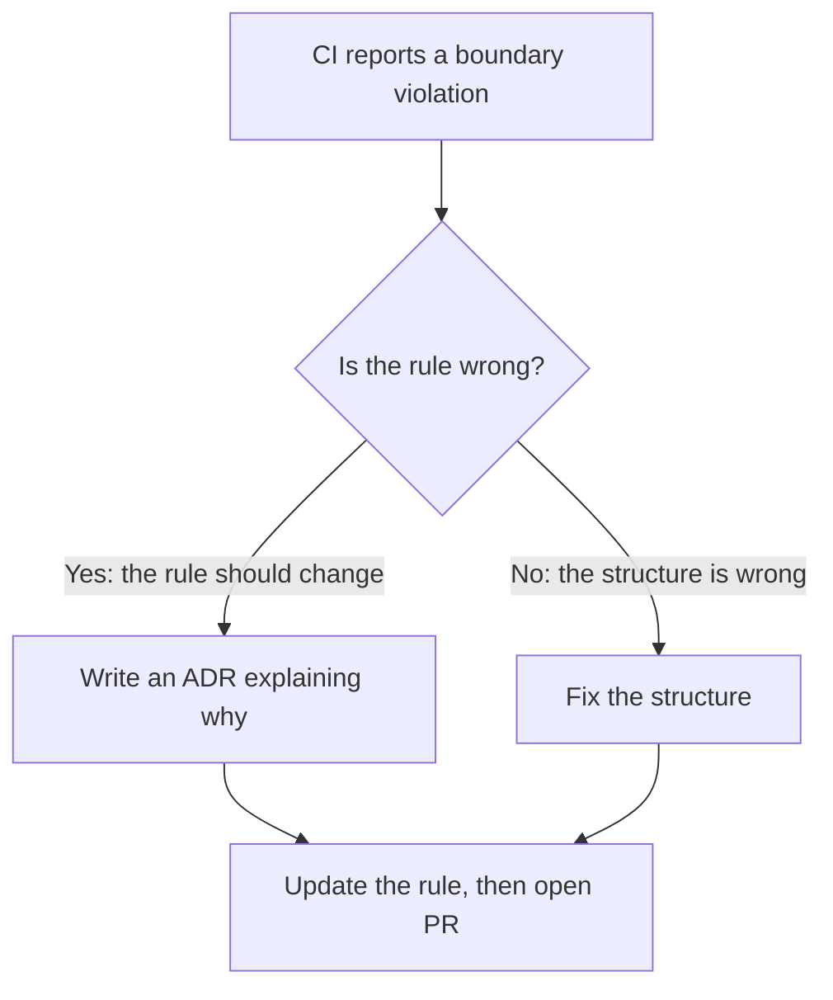

# Boundary rules

vaani's hex architecture is enforced by seven boundary rules.

**Mechanically checked** (Rules 2, 3, 4): `scripts/check-boundaries.sh` runs in CI and as a pre-commit hook. Violations fail the build.

**Enforced by the type system and `cargo check`** (Rules 1, 5, 6, 7): the compiler catches violations at build time.

## The seven rules

1. **Domain purity.** `domain.rs` depends only on `serde`, `thiserror`, and `std`. Adding any other dependency requires an [ADR](https://github.com/mox-labs/vaani/tree/main/docs/decisions).
2. **Port isolation.** Port modules (`source/mod.rs`, `decompose/mod.rs`, `nlp/mod.rs`) import only from `domain`.
3. **No cross-port imports.** No port module imports another port module.
4. **Single UDPipe importer.** `nlp/udpipe.rs` is the only file that imports `udpipe_rs`.
5. **Pure analyzer modules.** `metrics/` and `extraction/` import only from `domain` and `stopwords`.
6. **No-default-features must compile.** `cargo check --no-default-features` is a hard CI gate.
7. **Composition root knows the whole.** `lib.rs` is the only file that knows all adapters and ports.

## Why these rules

Each rule prevents a specific failure mode:

- Rules 1, 2, 5: keep the substrate independent. A domain that imports an adapter cannot be reused with a different adapter, defeating the hex layout.
- Rule 3: prevents hidden coupling between ports. For example, if `source/mod.rs` imported from `decompose/`, a `Source` implementation could start assuming that its output will be markdown-decomposed -- making it impossible to use that Source with a plain-text decomposer, even though the port contracts don't require that coupling. Cross-port imports smuggle assumptions that the port abstractions exist to prevent.
- Rule 4: contains UDPipe's C-side fragility (and its non-`Send` model) to one file. Changing NLP backends never touches the rest of the codebase.
- Rule 6: keeps optional features actually optional. A consumer who wants only the domain types and metrics should pay nothing for UDPipe.
- Rule 7: keeps the wiring explicit. A new adapter doesn't surreptitiously get picked up by some other adapter; it's wired in `lib.rs` or it doesn't exist.

## The boundary check script

```sh
#!/usr/bin/env bash
# scripts/check-boundaries.sh

# Rule 4: only nlp/udpipe.rs imports udpipe_rs
rg -l 'use udpipe_rs|udpipe_rs::' src/ --glob '!src/nlp/udpipe.rs'

# Rule 3: port modules do not import each other
rg -l 'use crate::source|use crate::decompose|use crate::nlp' \
    src/source/mod.rs src/decompose/mod.rs src/nlp/mod.rs
```

Each command must return empty. The script returns non-zero on violations, failing the pre-commit hook and CI.

## When you break a rule



The rules exist to prevent decay. Bending them once produces a precedent that bends them twice.
