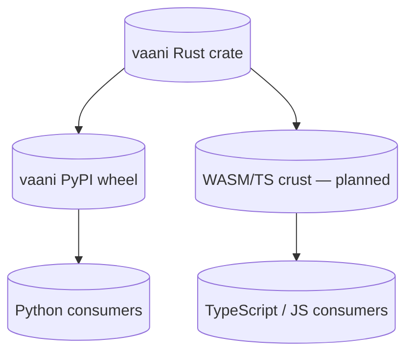

# Cross-language story

vaani is a Rust crate, a Python wheel, and a planned WASM/TypeScript crust. The Rust crate is the reference; the others are crusts that wrap it.



## Names cross. Methods do not.

Every public type, field, and enum variant name appears in at least two languages today, three when WASM lands. **Methods on those types do not.** Only fields cross the FFI.

This is why:

- `Token::is_punct` (field) is visible in the Python dict; `Sentence::tree_depth()` (method) is not.
- The Rust `Analysis::passive_ratio()` returns `f64`; the Python `result["sections"][...]` requires recomputing the ratio from the section tree if you want it Python-side.
- Adding a Rust method does not require a Python or WASM change; adding a Rust field does.

The rule shapes the type system: if cross-language consumers need an aggregate, it is materialized as a field on a summary type, not as a method.

## How types cross

### Rust → Python

Via `pythonize` (a serde-compatible serializer that produces Python dict/list/scalar values). Every serde-derived type in `domain.rs` is automatically crossable.

Python sees:

- Rust structs → Python dicts with string keys.
- Rust enums (unit variants only in our case for `Format`) → Python strings.
- Rust `Option<T>` → Python `None` or the inner value.
- Rust `Vec<T>` → Python list.
- Rust `String` → Python `str`.
- Rust `usize`, `f64` → Python `int`, `float`.

The Python wheel ships type stubs (`py.typed` + `_core.pyi`) so consumers' type checkers see exact TypedDict shapes.

### Rust → TypeScript (planned)

Via `serde-wasm-bindgen` and `wasm-bindgen`. The same serde derive that powers Python interop drives WASM interop. The same field-not-method rule applies.

## Error routing across FFI

The Rust `Error` enum's concrete variants surface as specific Python exception classes (not the catch-all `RuntimeError`). The mapping is defined in `lib.rs::python::VaaniError`:

| Rust variant | Python exception |
|---|---|
| `ModelNotFound` | `FileNotFoundError` |
| `InputTooLarge` | `ValueError` |
| `UnsupportedFormat` | `ValueError` |
| `Io(_)` | `OSError` |
| `ModelInvalid` | `RuntimeError` |
| `ParseFailed` | `RuntimeError` |

The match is exhaustive — adding a new Rust variant fails to compile until the boundary routes it. Variant identity is preserved by construction.

## Dual-publish via maturin

`Cargo.toml` owns Rust build semantics. `pyproject.toml` owns Python packaging. `maturin` is the build backend that produces a Python wheel from the Rust crate.

```toml
# Cargo.toml
[lib]
name = "vaani"
crate-type = ["rlib", "cdylib"]    # rlib for Rust deps, cdylib for Python loading

# pyproject.toml
[build-system]
requires = ["maturin>=1.0,<2.0"]
build-backend = "maturin"

[tool.maturin]
features = ["python", "udpipe"]
python-source = "python"
module-name = "vaani._core"
```

`module-name` matches `#[pymodule] pub fn _core(...)` in `lib.rs`. The wheel includes `py.typed` and `_core.pyi` via maturin's `[include]` section.

## Version pin discipline

The pyo3 + pythonize + maturin trio is co-versioned per the rust-mastery corpus's 3-axis ecosystem rule:

| Dep | Pin | Why |
|---|---|---|
| `pyo3 = "0.28"` | major.minor | Stable public API; multi-version skew fails to compile rather than silently UB. |
| `pythonize = "0.28"` | major.minor | Version-locked to pyo3 by spec. |
| `maturin >=1.0,<2.0` | major bound | Build-time tool, not runtime dep. |

When pyo3 releases a new minor version, bump both pyo3 and pythonize together.
