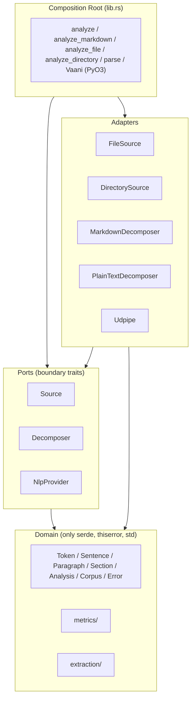

# Hex layout

vaani is a single Cargo crate organized as a hexagonal architecture: a pure domain core surrounded by ports (boundary traits), implemented by adapters (concrete I/O and infrastructure), wired together by a composition root (`lib.rs`).



Read it as: **dependencies point inward**. Nothing in `domain` knows that adapters exist. Adapters know about `domain` and the port they implement; they do not know about each other or about the composition root. The composition root is the only thing that knows everything.

Why does this matter? If `domain` imported an adapter (say, `domain.rs` referenced `udpipe_rs` directly), then swapping the NLP backend would require changing the domain types too. The domain would be coupled to one implementation of parsing, defeating the entire substrate role. The inward dependency rule is what keeps `cargo check --no-default-features` green: domain, metrics, and extraction compile without any NLP backend at all.

## Why hex for a substrate library

Three forces pushed this shape.

**Variable I/O needs.** A library wired into a CLI batch tool needs different ingestion than one embedded in an editor that streams documents as a user types, or one running headless against in-memory text. A hard-coded pipeline serves at most one of these. Ports let each consumer wire what they need.

**Cross-language reach.** Rust core + Python crust + future WASM crust. The domain types travel across FFI; the adapters do not. Keeping the boundary explicit means the FFI surface is exactly the domain types and a thin wrapper, not the whole library.

**Pre-publish economics.** Once 0.1.0 ships, the public surface is locked. Hex puts the surface where the contracts are (port traits + domain types) and keeps everything else replaceable.

## The composition root

`src/lib.rs` is the only file that:

- Imports adapters and ports together.
- Wires the pipeline (`analyze`, `analyze_markdown`, `analyze_file`, `analyze_directory`, `parse`, `analyze_from`).
- Exposes the PyO3 `Vaani` class behind the `python` feature.
- Enforces `MAX_INPUT_BYTES` at every public entry point.

Everything else is replaceable. The composition root is not.

## Layout

```
src/
├── lib.rs              # composition root + PyO3 bindings
├── domain.rs           # types: serde + thiserror + std only
├── source/             # Source port + FileSource + DirectorySource
├── decompose/          # Decomposer port + MarkdownDecomposer + PlainTextDecomposer
├── nlp/                # NlpProvider port + Udpipe adapter
├── metrics/            # metric functions: domain + stopwords only
├── extraction/         # extractor functions: domain + stopwords only
└── stopwords.rs        # shared utility
```

## Single-crate today, by design

The decision is documented in [ADR-0004](https://github.com/mox-labs/vaani/blob/main/docs/decisions/0004-stay-single-crate.md). The criterion for splitting (from the rust-mastery corpus's Pattern 6) is the existence of an external `NlpProvider` implementor ecosystem that needs to pin the contract independently. That ecosystem does not exist yet; until it does, single-crate is correct.

If a third-party `vaani-stanza`, `vaani-spacy`, or similar emerges, the port trait gets extracted into a minimal `vaani-nlp-api` crate and `vaani` becomes the consumer-facing crate that depends on it. The hex layout makes that migration mechanical.
