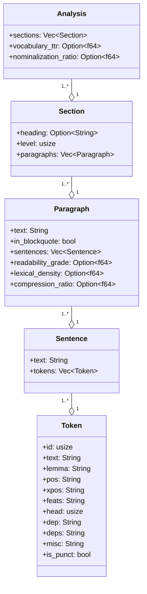

# Domain types

The domain model is the substrate. Every other module depends on it; it depends on nothing internal beyond `serde`, `thiserror`, and `std`.

## The hierarchy

Read it as containment: a `Token` lives inside a `Sentence`, a `Sentence` inside a `Paragraph`, a `Paragraph` inside a `Section`, a `Section` inside an `Analysis`. Each level has its own metrics surface.

## Token

The CoNLL-U token. All ten standard columns plus one derived convenience field.

| Field | Source | Meaning |
|---|---|---|
| `id` | CoNLL-U col 1 | 1-based position within the sentence |
| `text` | CoNLL-U col 2 | Surface form |
| `lemma` | CoNLL-U col 3 | Dictionary form |
| `pos` | CoNLL-U col 4 | Universal POS tag |
| `xpos` | CoNLL-U col 5 | Language-specific POS tag |
| `feats` | CoNLL-U col 6 | Morphological features, pipe-separated |
| `head` | CoNLL-U col 7 | Head token id; 0 means root |
| `dep` | CoNLL-U col 8 | Dependency relation to head |
| `deps` | CoNLL-U col 9 | Enhanced dependency graph |
| `misc` | CoNLL-U col 10 | Miscellaneous annotations |
| `is_punct` | derived | True iff the token is punctuation |

Constructed via `Token::builder(id, text, lemma, pos, head, dep)` plus optional `.xpos(...)`, `.feats(...)`, `.deps(...)`, `.misc(...)`, `.is_punct(...)`, then `.build()`. The builder lets external crates construct `Token` without struct-literal syntax (the struct is `#[non_exhaustive]`).

## Sentence

`text` plus `tokens` plus tree-walk methods. Every method is infallible and computes on demand.

| Method | Returns | Notes |
|---|---|---|
| `word_count()` | `usize` | Non-punctuation tokens. |
| `content_tokens()` | `Vec<&Token>` | Tokens excluding punctuation. |
| `is_passive()` | `bool` | `dep` matches `nsubj:pass`, `nsubjpass`, or `aux:pass`. |
| `tree_depth()` | `usize` | O(n) bottom-up walk with memoization; cycles return `usize::MAX`. |
| `root_token()` | `Option<&Token>` | The token with `head == 0`. |
| `children_of(id)` | `Vec<&Token>` | Direct dependents of `id`. |
| `head_of(id)` | `Option<&Token>` | The head of the token with the given id. |
| `subtree(id)` | `Vec<&Token>` | All tokens in the subtree rooted at `id`. Cycle-safe via visited set. |

Invariants:

- `tokens` are id-sorted ascending. UDPipe enforces this by spec; future adapters must too.
- `head = 0` means root. There should be exactly one root per sentence. Malformed parses are surfaced loudly via `tree_depth() == usize::MAX`, not silently truncated.

## Paragraph

A paragraph of prose with metric slots.

- `in_blockquote = true` paragraphs are skipped during metric computation; their `Option<f64>` slots stay `None`.
- `sentences` are populated during the pipeline's `parse` step (per-paragraph parse).

## Section

A heading + paragraphs. `level` is the heading depth (0 for plain text, 1+ for markdown `#`/`##`/etc.).

## Analysis

The pipeline output. Contains the section tree plus document-level metric slots (`vocabulary_ttr`, `nominalization_ratio`).

Aggregate methods (`total_sentences`, `total_words`, `passive_ratio`, `mean_sentence_length`, `sentence_length_std`) are Rust-only — they do not cross FFI. Python and (future) WASM consumers either recompute aggregates from the section tree or read the slot fields directly.

## Corpus

`Vec<CorpusEntry>` where each entry has a `path` and an `Analysis`. Aggregate methods: `total_words`, `passive_ratio`, `mean_readability`.

Produced by `analyze_directory(...)` along with a parallel error vector recording per-document analysis failures.

## ScoredSentence and Keyphrase

The extraction outputs.

- `ScoredSentence { text: String, score: f64, position: usize }` — output of TF-IDF and TextRank.
- `Keyphrase { phrase: String, score: f64 }` — output of RAKE and YAKE.

## RawDocument, Format

`RawDocument { text, path, format }` is the output of `Source::read`; `Format` is `Markdown | PlainText | Pdf | Docx`. The last two are reserved; today they return `Error::UnsupportedFormat` (see [Errors](./errors.md)).

## Why every public type is `#[non_exhaustive]`

Forward compatibility. Adding a field or variant later is a minor-version change; without `#[non_exhaustive]` it would be a breaking change. Pattern matches on `#[non_exhaustive]` enums require an `_` arm, forcing consumers to write code that survives variant additions.

This is the cost of being a substrate: every public name is a contract. The `#[non_exhaustive]` annotation makes the contract evolvable.

## Cross-language considerations

Every type in this section appears in two languages today, three when the WASM crust lands:

- **Rust struct/enum** — the reference.
- **Python dict** via `pythonize`. Field names become string keys; methods do not appear (only fields cross FFI).
- **TypeScript interface** (planned, via `serde-wasm-bindgen`). Same field names, same methods-don't-cross rule.

Names are picked to read clearly in three languages.
