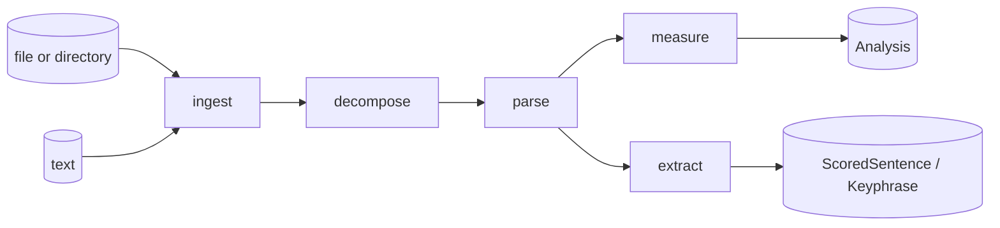

# The pipeline

vaani's processing pipeline is five verbs: **ingest, decompose, parse, measure, extract**. The first three run in sequence; `measure` and `extract` are peers that both consume the output of `parse`.



Each stage has a well-defined input, output, and contract.

## ingest

**Input:** a path or a `&str`.
**Output:** `RawDocument` (text + path + format).
**Postcondition:** format detected; bytes resident in memory; size <= `MAX_INPUT_BYTES` (8 MiB).

`FileSource` and `DirectorySource` are the built-in adapters. `FileSource` reads a single file with symlink rejection and size capping before any disk read. `DirectorySource` walks a directory (non-recursive), skips symlinks, sorts paths lexicographically, and tolerates per-file failures.

## decompose

**Input:** `&str` (the text bytes).
**Output:** `Vec<Section>` (heading + paragraphs).
**Postcondition:** paragraphs in document order; `in_blockquote` flags set; no parsed sentences yet (that comes later).

`MarkdownDecomposer` honors heading levels and blockquote membership; `PlainTextDecomposer` splits on blank lines and produces one heading-less section.

Decomposers are infallible. Malformed markdown is treated as plain text; plain text never fails on text.

## parse

**Input:** `&str` (one paragraph at a time, in the standard pipeline).
**Output:** `Vec<Sentence>` (each sentence has tokens with full CoNLL-U annotation).
**Postcondition:** sentences in document order; tokens within each sentence id-sorted ascending; exactly one token per sentence has `head = 0`; all `head` references valid.

`Udpipe` is the default adapter, behind the `udpipe` feature flag. UDPipe panics at the C++ boundary are caught and converted to `Err(ParseFailed(_))`. They never abort the host process.

The composition root parses **per paragraph**, not per document. The reason is a concrete failure the whole-document approach produced: when two paragraphs shared the same opening words, the wiring that matched parsed sentences back to their source paragraphs (using a string-prefix search) could silently assign the first sentence of paragraph B to paragraph A, dropping B's sentences entirely. Per-paragraph parse removes the ambiguity -- each paragraph's sentences come straight out of parsing that paragraph's text, so no matching step is needed and no sentence can end up in the wrong paragraph. The secondary benefit is bounded peak memory: one paragraph at a time, not the whole document.

## measure

**Input:** `&mut Analysis` and `&[Sentence]`.
**Output:** enriched `Analysis` with per-paragraph and per-document metric slots filled in.
**Postcondition:** every paragraph has `Some(metric)` if its sentences were assigned, `None` otherwise (blockquote paragraphs are skipped).

The default metric suite (`metrics::default_suite`) runs:

- **readability:** Flesch-Kincaid grade level per paragraph
- **lexical density:** content-word ratio per paragraph
- **compression ratio:** brotli compression ratio per paragraph (a redundancy proxy)
- **vocab TTR:** type-token ratio at the document level
- **nominalization ratio:** fraction of `-tion`-class nouns at the document level

Consumers compose a different suite by selecting from `metrics::*` directly.

## extract

**Input:** `&[Sentence]`.
**Output:** `Vec<ScoredSentence>` (top-N sentences) or `Vec<Keyphrase>` (ranked phrases).
**Postcondition:** scores in descending order; output bounded by the per-extractor cap.

Four extractors:

- **tfidf_summarize:** TF-IDF over sentences; returns top-N sentences. Capped at `MAX_SENTENCES = 2000`.
- **textrank_summarize:** TextRank over similarity graph; returns top-N sentences. Capped at `MAX_SENTENCES = 2000` (the O(n²) similarity matrix is the bound).
- **rake_keyphrases:** RAKE word-co-occurrence; returns ranked phrases. Capped at `MAX_TOKENS = 200_000`.
- **yake_keyphrases:** YAKE statistical phrase scoring; returns ranked phrases. Capped at `MAX_TOKENS = 200_000`.

Each cap has its own arithmetic justification; the constants are deliberately not shared because the cost models differ (sentence-bound vs token-bound).

## Why measure and extract are peers

`measure` and `extract` are not nested under each other. Both consume the parsed sentences directly:

```
ingest -> decompose -> parse -> measure
                      parse -> extract
```

Parse is the expensive step -- UDPipe runs a full dependency analysis on every sentence, walking the dependency graph to produce the CoNLL-U annotations that metrics and extractors both depend on. Everything downstream is cheap by comparison. Putting parse at the fork, rather than inside each branch, means a document that needs both an `Analysis` and a keyphrase list pays for the NLP exactly once. See [Quickstart](../getting-started/quickstart.md) for the code.

## The bound is at the entry

`MAX_INPUT_BYTES = 8 MiB` is checked at every public entry point in the composition root (`analyze`, `analyze_markdown`, `parse`, `analyze_from`, the PyO3 methods). Source adapters check file metadata size *before* reading into memory. Extractors check their own `MAX_SENTENCES` or `MAX_TOKENS` cap.

Every `InputTooLarge` error carries a `what: &'static str` discriminator so consumers can distinguish the apex limit from per-extractor caps. See [Errors](./errors.md#the-what-discriminator-on-inputtoolarge) for the full table of `what` values and where each fires.
