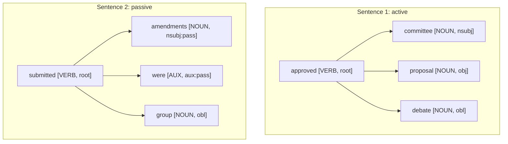
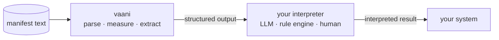

# vaani

> vaani illuminates the internal structural makeup of text, enabling effective higher-order reasoning on text.

**Ships today (✅):** structured parse (POS, lemmas, dependencies, sentences, paragraphs, sections), document metrics (readability, lexical density, TTR, nominalization, passive ratio), summarization (TF-IDF, TextRank), keyphrase extraction (RAKE, YAKE).

**Planned (🛠️ v0.2+):** rule evaluation, relation extraction, schema extraction, modality detection, speech act classification.

---

## Install

**Rust**

```toml
[dependencies]
vaani = "0.0"
```

**Python**

```bash
pip install vaani
```

---

## Five lines to a structured analysis

```python
from pathlib import Path
from vaani import Vaani

v = Vaani.english("~/.vaani/models")        # downloads ~16 MB on first call
result = v.analyze_markdown(Path("essay.md").read_text(encoding="utf-8"))

print(result["sections"][0]["paragraphs"][0]["readability_grade"])
print(result["vocabulary_ttr"])
```

The result is a typed dict that mirrors the Rust `Document` type. Every field is stable, serializable, and traversable: document to section to paragraph to sentence to token. Query the fields your reasoning layer needs; ignore the rest.

---

## What the structure looks like

Take two sentences with contrasting agency, of the kind a content-classification pipeline or an authorship-analysis system needs to distinguish:

```
The committee approved the proposal without debate.
Three amendments were submitted by the working group.
```

vaani parses each sentence into a dependency tree. The first is active: "committee" is the agent (`nsubj`), "proposal" is the patient (`obj`). The second is passive: "amendments" carries `nsubj:pass`, "group" carries `obl` via "by."



That dependency structure is the substrate. Your application reasons over it: which sentences hedge, which commitments are made by named agents, whether the passive ratio signals intentional voice. vaani measures; your application decides.

---

## What vaani provides

**✅ Structured parse.** Every token gets its lemma, part of speech, dependency relation (`dep`), and head position. Tokens nest into `Sentence`, sentences into `Paragraph`, paragraphs into `Section`, sections into `Document`. The result is a typed hierarchy you can traverse.

**✅ Document metrics.** Flesch-Kincaid readability grade, lexical density, vocabulary type-token ratio, nominalization ratio, passive ratio, brotli compression ratio. These are instruments, not scores. vaani measures; your system judges.

**✅ Summarization.** Extractive summaries via TF-IDF (sentence-frequency coverage) and TextRank (graph-coherence ranking). You choose the algorithm based on what "summary" means for your application.

**✅ Keyphrase extraction.** RAKE (fast, rule-based) and YAKE (positional + statistical). Both return ranked keyphrases your system can act on.

**🛠️ Planned v0.2+.** Rule evaluation over the parsed structure, enabling relation extraction, schema extraction, modality detection, and speech act classification.

---

## The architecture: vaani structures, you interpret



vaani does not reason. It structures. The reasoning is yours. Feeding an LLM typed dependency trees, passive ratios, and ranked keyphrases is different from feeding it the same text as a string. The same holds whether you are building a contract-review tool, a content classifier, or a voice-signature analyzer. The reasoning becomes groundable.

spaCy is also a structural NLP library (dependency parse, POS, named entity recognition); vaani is Rust-first with Python bindings via PyO3, ships with a stable cross-language domain type hierarchy, and is designed as a substrate (bounded inputs, panic-safe FFI, atomic model loading) rather than a general-purpose toolkit.

The full argument for this architectural separation is in [What vaani illuminates](./architecture/conviction.md).

---

## How to read this book

**Ready to start:**
[Installation](./tutorials/installation.md) and [Quickstart](./tutorials/quickstart.md) get you to a working analysis in five minutes.

**Building with vaani from a specific language:**
[Rust](./guides/rust.md), [Python](./guides/python.md), and [CLI](./guides/cli.md) cover the day-to-day usage path.

**Understanding the NLP behind the surface:**
[Concepts](./concepts/affordances.md) maps what vaani offers and explains the underlying ideas: UDPipe and CoNLL-U, dependency parsing, readability and lexical metrics, summarization, keyphrase extraction.

**Looking up a specific API, type, or formula:**
[Domain types](./reference/domain-types.md), [Errors](./reference/errors.md), [Methodology](./reference/methodology.md), and the [rustdoc](./reference/api-reference.md) are designed for lookup, not reading.

**Evaluating fit at the architectural level:**
[What vaani illuminates](./architecture/conviction.md) explains the grounding-substrate framing, the four faces of voice, and what the record and abstract tiers mean for your application.

**Try it without writing code:**
[Interactive playground](./playground/index.md) 🛠️. Available when the WASM crust ships.

**Extending vaani** (new format, new NLP backend, new metric):
[Hex layout](./architecture/hex.md) and [Write a new adapter](./guides/new-adapter.md) are the entry points.
