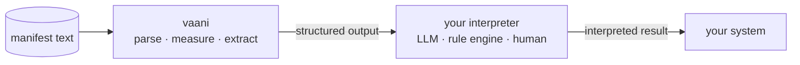

# vaani

> vaani illuminates the internal structural makeup of text, enabling effective higher-order reasoning on text.

**Ships today (✅):** structured parse (POS, lemmas, dependencies, sentences, paragraphs, sections), document metrics (readability, lexical density, TTR, nominalization, passive ratio), summarization (TF-IDF, TextRank), keyphrase extraction (RAKE, YAKE).

**Planned (🛠️ v0.2+):** rule evaluation, relation extraction, schema extraction, modality detection, speech act classification.

---

## What vaani does

Text arrives as words. What those words are *doing* stays invisible until structure is applied: which clause is passive, which sentence governs the paragraph, where authorship is most concentrated.

vaani applies that structure. A concrete example:

**Input.**
```
The committee approved the proposal without debate.
Three amendments were submitted by the working group.
```

**vaani output.**
```
sentence 1 — active voice, root verb "approved"
  approved [VERB, root]
  ├─ committee [NOUN, nsubj]
  ├─ proposal [NOUN, obj]
  └─ debate    [NOUN, obl via "without"]

sentence 2 — passive voice, root verb "submitted"
  submitted [VERB, root]
  ├─ amendments [NOUN, nsubj:pass]
  ├─ were       [AUX, aux:pass]
  └─ group      [NOUN, obl:agent via "by"]

document metrics
  readability_grade   11.2
  passive_ratio        0.50
  lexical_density      0.61
```

That is the substrate. Every field is typed, stable across Rust and Python, and serializable to JSON. Your application reasons over it.

---

## What vaani provides

**✅ Structured parse.** Every token gets its lemma, part of speech, dependency relation (`dep`), and position in the sentence's dependency tree (`head`). Paragraphs and sections nest inside. The result is a typed hierarchy you can traverse: from document to section to paragraph to sentence to token.

**✅ Document metrics.** Readability grade (Flesch-Kincaid), lexical density, vocabulary type-token ratio, nominalization ratio, passive ratio, brotli compression ratio. These are instruments, not scores. vaani measures; your system judges.

**✅ Summarization.** Extractive summary via TF-IDF and TextRank. You choose the algorithm based on what "summary" means for your application: sentence-frequency coverage (TF-IDF) or graph-coherence ranking (TextRank).

**✅ Keyphrase extraction.** RAKE and YAKE. RAKE is fast and rule-based; YAKE adds positional and statistical context. Both return ranked keyphrases your system can act on.

**🛠️ Planned v0.2+.** Rule evaluation over the parsed structure, enabling relation extraction, schema extraction, modality detection, speech act classification, and voice signature analysis. Without rule evaluation, vaani delivers the record layer: tokens, dependencies, metrics. Rule evaluation is what extends that reach to the relational layer that higher-order reasoning systems need.

---

## The architecture: vaani structures, you interpret

The most important thing vaani does not do: interpret.

```
manifest text  →  vaani [parse · measure · extract]  →  your interpreter [LLM · rule engine · human]  →  your system
```

vaani produces structure. The reasoning over that structure belongs to whatever interpreter you bring: what the passive ratio means, whether the dependency pattern signals a hedged claim, whether the lexical density fits the intended audience. In an LLM-native pipeline, the LLM is that interpreter; vaani gives it measurable handles instead of raw bytes.

This is not a limitation. It is the design. Feeding an LLM structured text (with token roles, dependency trees, and readability grades attached) is different from feeding it the same text as a string. The reasoning becomes groundable. The structure vaani provides makes the LLM's work auditable, not replaced.



---

## vaani measures; your application decides

The passive ratio and readability grade look like Grammarly output. They are not. vaani tells you that 50% of sentences in a document are passive constructions; it does not tell you whether that is a problem. The judgment is yours. vaani measures; your application decides what the measurement means.

This also means vaani does not compete with transformer-based NLP. Transformers predict: they learn distributions over tokens and generate or classify. vaani reveals: it applies a deterministic structural analysis that produces the same typed output for the same input every time. Different category, different use.

---

## How to read this book

**Ready to start:**
[Installation](./tutorials/installation.md) and [Quickstart](./tutorials/quickstart.md) get you to a working analysis in five minutes.

**Building with vaani from a specific language:**
[Rust](./guides/rust.md), [Python](./guides/python.md), and [CLI](./guides/cli.md) cover the day-to-day usage path.

**Understanding the NLP behind the surface:**
[Concepts](./concepts/affordances.md) maps what vaani offers and explains the underlying ideas: UDPipe and CoNLL-U, dependency parsing, readability and lexical metrics, summarization, keyphrase extraction.

**Looking up a specific API, type, or formula:**
[Domain types](./reference/domain-types.md), [Errors](./reference/errors.md), [Methodology](./reference/methodology.md), and the [rustdoc](./reference/api-reference.md) are designed for lookup, not reading.

**Evaluating fit at the architectural level:**
[What vaani illuminates](./architecture/conviction.md) explains the grounding-substrate framing, the four faces of voice, and what the record and abstract tiers mean for your application. Read this before the quickstart if you want to understand the shape before committing.

**Try it without writing code:**
[Interactive playground](./playground/index.md) 🛠️. Paste any text and see the structure appear. Available when the WASM crust ships.

**Extending vaani** (new format, new NLP backend, new metric):
[Hex layout](./architecture/hex.md) and [Write a new adapter](./guides/new-adapter.md) are the entry points.
