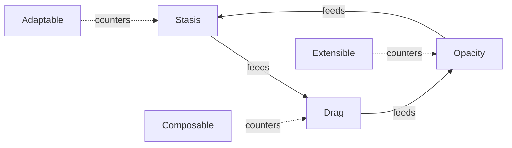

# ACES and antifragility

Two non-negotiable disciplines underpin vaani: **ACES** (the structural design philosophy) and **antifragility** (the operational discipline). ACES protects vaani from slow decay. Antifragility protects vaani from sudden death. A library missing either is a library that ages badly, or fails badly.

## ACES: the structural design philosophy

Every long-lived system decays through three endogenous forces:

- **Stasis:** the system stops evolving. Decisions harden. New requirements fight the architecture instead of fitting into it.
- **Drag:** complexity accumulates. Dependencies tangle. Simple changes take weeks.
- **Opacity:** understanding fades. Workarounds compound. Nobody knows why something works (or whether it does).

**Opacity feeds stasis feeds drag.** A codebase nobody fully understands cannot evolve safely; an unevolving codebase forces workarounds that pile on as drag; the drag obscures what's still load-bearing, deepening the opacity. ACES is the discipline that resists the cycle.

### Three counter-forces

**Adaptable:** design for change. Counters stasis. Configuration over hardcoding. Feature flags additive and orthogonal. Public types `#[non_exhaustive]`. Boundary rules stated explicitly so future maintainers know what they can move and what they can't.

**Composable:** discrete components, clear boundaries, swappable parts. Counters drag. Three ports, multiple adapters per port, one composition root. Each piece has a single responsibility and a single boundary; replacing one piece does not require rewriting any other.

**Extensible:** clear interfaces that invite contribution without requiring full comprehension. Counters opacity. A new contributor should be able to add a new `Source`, `Decomposer`, or `NlpProvider` adapter by reading only the port trait and one existing adapter, not by reading the whole codebase. The rule is not a guideline. The boundary check script in CI fails if an adapter imports from another adapter, making opacity structurally costly to introduce.

### The boundary test

For every structural change, ask three questions:

1. **Does this make the system more adaptable, or less?** More: makes a hardcoded constant configurable, preserves `#[non_exhaustive]`, gates a new capability behind a feature flag. Less: locks in a specific backend, removes `#[non_exhaustive]`, couples previously-independent features.

2. **Does this make the system more composable, or less?** More: adds a port adapter that implements an existing port, splits a god-module into smaller files with clear responsibilities. Less: adds a cross-adapter import, blurs a boundary between ports, makes the composition root know less by making adapters know more.

3. **Does this make the system more extensible, or less?** More: adds rustdoc to a previously-undocumented surface, writes an ADR for a non-obvious decision, simplifies a trait signature. Less: removes rustdoc, hides a public type, adds a workaround without explaining why.

A change that is good engineering but violates ACES is not good for vaani. The disciplines exist so that when scale arrives, the decay cycle never gets started.

## Antifragility: the operational discipline

Where ACES designs the system to *evolve*, antifragility designs it to *fail well*. The Taleb principles applied at vaani's boundaries:

- **Bounded inputs everywhere.** Unbounded input = unbounded resource use. The cap is a feature, not a limitation.
- **Single Points of Failure are bugs.** The UDPipe C boundary was an SPOF (one bad parse = one dead process); `catch_unwind` removed it.
- **Fail loud, not silent.** Cycles in graph walks return `usize::MAX`. Mismatched hashes refuse to load. Oversized inputs error at the gate. Never silently truncate, downgrade, or proceed.
- **Atomic over racy.** If two processes can race, the answer is atomic operations (rename, CAS), not "hope it works."
- **Trust anchors are pinned, not configurable.** The UDPipe model SHA-256 is a `const` in source, not an env var.

### The six disciplines

The full list lives in `.claude/skills/resilience-floor/SKILL.md`. In summary:

1. **Size caps at the entry point**, not deep in the call stack. `MAX_INPUT_BYTES = 8 MiB` at every public entry.
2. **Symlink rejection.** Filesystem adapters use `symlink_metadata` (non-traversing).
3. **Atomic file writes** via per-process temp + rename.
4. **TOCTOU closure** on hash-verified loads: return the verified bytes, don't re-read.
5. **`catch_unwind` panic boundary** at every C/C++/FFI call site.
6. **Cycle-safety in graph walks.** Visited sets, not magic-number ceilings.

## Why both, why non-negotiable

They are **non-negotiable** because vaani is a public OSS substrate intended as an exemplar. Every contributor (human or AI) is held to both. The PR review gate (`.claude/agents/reviewer.md`) checks ACES compliance as Gate 0 and the antifragility checklist as Gate 4. A PR that fails either does not merge until it grounds in an ADR justifying the trade.

The reason to hold the line is not rigor for its own sake. A substrate is inherited. The contributor who weakens a boundary today is not the one who pays for it. The consumer downstream, the future maintainer, the project that builds on vaani and trusts the contract: those are the ones who pay. ACES and antifragility are the disciplines that make the substrate worth inheriting.

## The collaborative-intelligence frame

These two disciplines also frame how human-AI collaboration works on this project. The human brings the divergent cognition, the frame-break, the insight outside the current context. The machine brings the convergent architecture, synthesis, pattern recognition, throughput within a frame.

ACES is the structural language both parties speak. Antifragility is the operational checklist neither party gets to skip. Together they make the collaboration produce code that survives, not just code that compiles.
