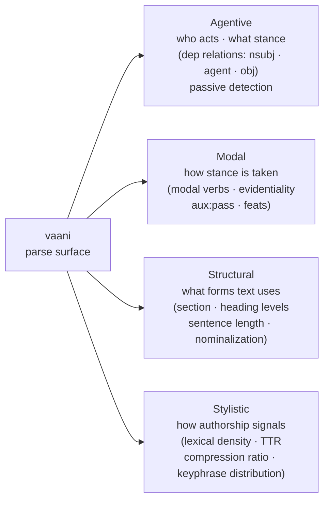

# The four faces of voice

Voice is plural.

A legal brief, a product review, a research paper, and a tweet can all be "formal" or "informal" by readability grade, but they differ in something more specific: who is speaking, what stance they take, what argumentative form they use, how distinctive their word choices are. These are not the same dimension. A readability score collapses them into one number; vaani does not.

vaani exposes a single parse surface. Four different categories of application read different faces from it:

The four faces are not four products. They are four lenses on one substrate. `analyze()` returns one `Document`; what you query from it depends on what your application is trying to know.

---

## Agentive voice

**What it is.** Agentive voice names the distribution of agency in a text: who acts, who is acted upon, and what the author's stance toward those relationships is. A passive-heavy construction ("mistakes were made") hides the agent. An active, subject-forward construction names it. Agency is not just a stylistic choice. It is a signal of commitment, evasion, responsibility, and stance.

Discourse analysis, rhetorical criticism, and relationship-dynamics research all work primarily from the agentive face. The fundamental question is: *whose action drives the text?*

**What vaani provides.**

Record tier ✅:
- Dependency arcs: `nsubj` (nominal subject), `agent` (passive agent, "by X"), `obj` (direct object), `nsubjpass` (passive subject)
- `Sentence::is_passive()`: detects passive constructions across the sentence
- Passive ratio at the document level via `Document`

Abstract tier 🛠️ (planned v0.2+ via rule evaluation):
- Relation triples: `(subject, verb, object)` extracted as structured tuples
- Intent markers: dependency patterns that signal assertion, question, denial, concession
- Speech act classification: illocutionary force detected over the parse

**Concrete example.**

Text: *"The board approved the restructuring plan after management presented revised projections."*

vaani's parse surfaces:

| Token | POS | Dep label | Head |
|---|---|---|---|
| board | NOUN | nsubj | approved |
| approved | VERB | root | (none) |
| restructuring | NOUN | compound | plan |
| plan | NOUN | obj | approved |
| management | NOUN | nsubj | presented |
| presented | VERB | advcl | approved |
| projections | NOUN | obj | presented |

Two agents, two actions, a causation relationship. A relationship-dynamics application reading this record can see: management acted first (presented), the board acted second (approved). An application tracking who initiates vs responds, or who holds decision authority, has the handles it needs.

**Who builds on this.** Applications that map decision dynamics in organizational text, tools that trace attribution and responsibility in documents, systems that analyze interpersonal dynamics from written records.

---

## Modal voice

**What it is.** Modal voice captures how a speaker positions their claims: as certain or hedged, as required or optional, as their own assertion or reported from elsewhere. Modality is not about what a text says. It is about how the speaker commits to it.

Speech act theory (Austin, Searle), evidentiality linguistics, and argument-mapping systems work primarily from the modal face. The fundamental question is: *with what force does the author hold this claim?*

**What vaani provides.**

Record tier ✅:
- Auxiliary verb detection via POS tagging (modal verbs: "must," "might," "should," "could," "would")
- `aux:pass` dependency label for passive auxiliaries
- Morphological features (`feats` field) including Mood, Voice, Tense, Number where UDPipe provides them
- Full token sequence with POS: the raw material for modal pattern matching

Abstract tier 🛠️ (planned v0.2+ via rule evaluation):
- Modality detection: rules over the parse that classify sentences as assertive, hedged, deontic, or epistemic
- Evidentiality patterns: identifying "according to," "reportedly," "it is believed that" framings

**Concrete example.**

Text: *"This approach should address the core issue, though edge cases might require additional handling."*

Relevant tokens surfaced by vaani:
- "should": POS AUX, dependency aux, head "address" (deontic modal)
- "might": POS AUX, dependency aux, head "require" (epistemic modal)

The first clause is a deontic commitment (the author believes this *ought* to work). The second is an epistemic hedge (possibility, not certainty). A system building argument maps or commitment trackers reads these two modal auxiliaries from the `Token.pos` and `Token.dep` fields today. When abstract-tier rule evaluation lands, it will surface these as named modality classifications without requiring the consumer to write the POS-matching logic themselves.

**Who builds on this.** Systems that classify sentence-level commitment in policy documents or contracts, argument-mapping tools that distinguish assertion from hedged inference, applications that extract the epistemic status of claims from research or review text.

---

## Structural voice

**What it is.** Structural voice describes the rhetorical and organizational forms a text uses: how it sections its argument, how long its sentences run, how nominalized its prose is, how it signals hierarchy. Two texts can make the same claim with the same word choices but use radically different structures: one as a numbered list with sub-headings, one as flowing prose with embedded subordinate clauses.

Discourse analysis and genre theory work primarily from the structural face. The fundamental question is: *what formal conventions is this text using to carry its argument?*

**What vaani provides.**

Record tier ✅:
- `Section` hierarchy: heading levels, paragraph boundaries, `in_blockquote` flags
- `Sentence` objects with word counts and dependency tree depths
- Nominalization ratio at the document level: fraction of `-tion`-class nouns (signals heavy nominalization)
- Readability grade per paragraph (Flesch-Kincaid): a compound measure of sentence length and syllable complexity
- Lexical density per paragraph: ratio of content words to total words
- Brotli compression ratio per paragraph: a redundancy proxy (repetitive structure compresses more)

Abstract tier 🛠️ (planned v0.2+ via rule evaluation):
- Schema extraction: identifying argument patterns (claim-evidence, problem-solution, compare-contrast) as structured rule outputs
- Relation triples as structural primitives for downstream graph construction

**Concrete example.**

Text (a two-paragraph excerpt):

> **Background**
> The study examined three intervention modalities. Modality A involved direct instruction; Modality B involved peer scaffolding; Modality C combined both.
>
> **Results**
> Participants in Modality C demonstrated significantly greater improvement on all measured outcomes, with effect sizes ranging from 0.4 to 0.7.

vaani's structural output:
- Two sections with headings "Background" and "Results" (`Section.heading`)
- First paragraph: 3 sentences, average 10 words, lexical density ~0.55
- Second paragraph: 1 sentence, 20 words, nominalization present ("improvement," "outcomes")
- Nominalization ratio (document-level): present via `-tion`-class nouns ("instruction," "intervention")

An application that categorizes text by rhetorical genre, or that extracts the claim-evidence structure of an argument, reads the section hierarchy and sentence-level metrics from the same `Document` that a summarization system uses for its TF-IDF scores.

**Who builds on this.** Tools that classify document genre or rhetorical form, systems that extract argument structure from research or policy text, applications that compare how different authors structure the same type of document.

---

## Stylistic voice

**What it is.** Stylistic voice is the aggregate fingerprint of an author's lexical and syntactic choices. Not what they say, not how they organize it, but the characteristic patterns that make their prose theirs: unusual vocabulary richness, consistent sentence length, particular phrase distributions. These patterns are stable enough across documents to function as an authorial signature.

Stylometry, authorship attribution, and writing-coach applications work primarily from the stylistic face. The fundamental question is: *how distinctive are this author's choices, and in what direction do they diverge from a baseline?*

**What vaani provides.**

Record tier ✅:
- Vocabulary TTR (type-token ratio) at the document level: the ratio of unique lemmas to total words. A TTR of 0.3 suggests template-like repetition; a TTR above 0.7 suggests highly varied vocabulary. ✅
- Lexical density per paragraph: content-word ratio (nouns, verbs, adjectives, adverbs vs function words)
- Compression ratio per paragraph: brotli compression measures how much the paragraph's surface form can be reduced (a proxy for syntactic and lexical redundancy)
- Keyphrase distribution via RAKE and YAKE: the ranked phrases that are statistically or structurally most prominent in the document

Abstract tier 🛠️ (planned v0.2+ via rule evaluation):
- Voice signature type: a typed struct encoding an author's stylometric profile across multiple documents (TTR distribution, sentence length histogram, keyphrase semantic clusters, nominalization tendency)

**Concrete example.**

Two paragraphs, same topic, different authors:

*Author A:* "The implementation leverages a modular architecture. Each component interfaces with adjacent components through well-defined APIs. Integration testing validates inter-component communication."

*Author B:* "The code is built in pieces that talk to each other through clear boundaries. Tests check that the pieces connect correctly."

vaani produces:
- Author A TTR: ~0.62 (many unique technical terms per sentence)
- Author B TTR: ~0.72 (fewer words per sentence but nearly all unique)
- Author A lexical density: ~0.71 (heavy nominalization: "implementation," "architecture," "communication")
- Author B lexical density: ~0.65 (more action verbs, fewer nominalizations)
- Author A nominalization ratio: higher (leverages, interfaces, validates: verb-derived nominals)

A writing-coach application can show Author A how their prose compares to Author B's on these dimensions. An authorship attribution system can use these patterns as features. The metrics are the ground; the application brings the judgment about what they mean.

**Who builds on this.** Writing assistance tools that give authors specific feedback on their stylometric profile, authorship attribution systems, corpus comparison tools that characterize how different writers approach the same genre.

---

## One substrate, four lenses

No consuming application uses only one face. A writing coach reads stylistic voice primarily but checks passive ratio (agentive) and sentence structure (structural). A relationship-dynamics analyzer reads agentive voice primarily but uses modal voice to distinguish commands from suggestions.

The four faces are not a taxonomy of separate capabilities. They are a map of how different applications read from the same `Document`. Your application decides which fields to query and what to infer from them. vaani's job is to make the structure accessible so that decision is yours to make.

At record tier ✅, all four faces have signal available now. At abstract tier 🛠️, rule evaluation will add typed outputs (named relation triples, modality classifications, schema patterns, voice signature structs) that make the faces available at higher resolution without requiring each consumer to write their own parse-pattern logic.

For the conviction behind why these tiers exist, see [What vaani illuminates](./conviction.md). For the planned abstract-tier capabilities and their trigger conditions, see the [Roadmap](../reference/roadmap.md).
